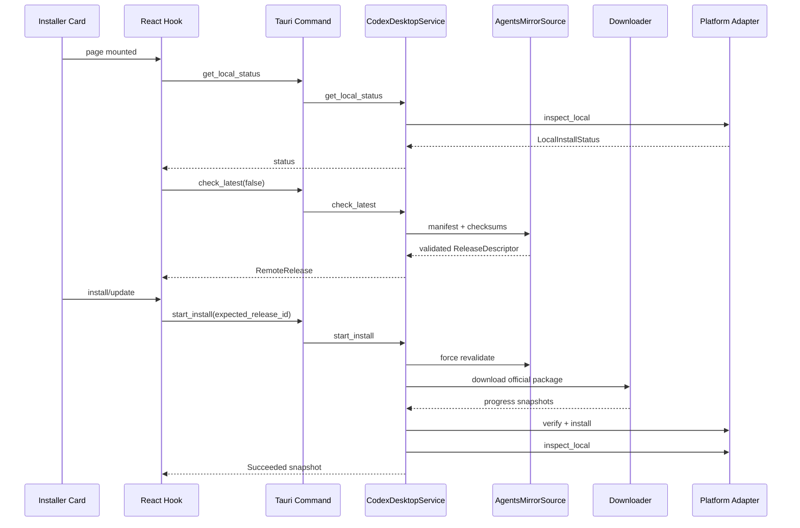
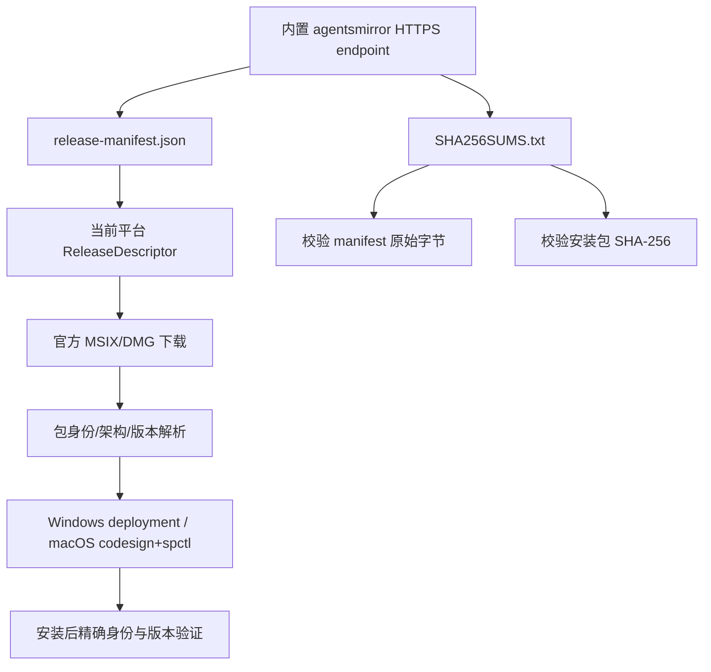

# 总体架构设计

## 1. 架构目标

新增桌面应用安装能力时，保持 CC Switch 现有分层：

```text
Tauri commands：IPC 边界
Services：业务编排和共享状态
Root domain modules：协议、解析、平台能力
AppState：跨命令生命周期服务
```

前端保持：

```text
Component → Hook → TanStack Query/API → Tauri invoke/event
```

V1 不引入数据库表、不创建独立后台服务、不把安装状态持久化、不重构现有 Provider/Proxy 核心。

## 2. 现有源码锚点

上传快照中的关键结构：

```text
src-tauri/src/store.rs                 AppState
src-tauri/src/services/mod.rs          service 注册与 re-export
src-tauri/src/commands/mod.rs          Tauri commands 注册
src-tauri/src/lib.rs                   启动、manage、invoke_handler
src-tauri/src/proxy/http_client.rs     全局代理配置与 HTTP client
src-tauri/src/commands/misc.rs         CLI 工具版本和生命周期
src/components/settings/AboutSection.tsx
src/App.tsx
src/lib/api/*
src/lib/query/*
src/i18n/*
```

`AppState` 当前持有数据库、`ProxyService` 和 `UsageCache`。新安装任务跨多个 IPC、页面和事件，因此应加入长期存在的 `CodexDesktopService`。

## 3. 目标模块结构

```text
src-tauri/src/
├── codex_desktop/
│   ├── mod.rs
│   ├── types.rs
│   ├── error.rs
│   ├── source.rs
│   ├── download.rs
│   ├── verify.rs
│   └── platform/
│       ├── mod.rs
│       ├── windows/
│       │   ├── mod.rs
│       │   ├── manifest.rs
│       │   ├── deployment.rs
│       │   └── elevation.rs
│       └── macos/
│           ├── mod.rs
│           ├── bundle.rs
│           └── dmg.rs
├── services/
│   └── codex_desktop/
│       ├── mod.rs
│       └── job.rs
└── commands/
    └── codex_desktop.rs
```

### 3.1 领域模块

`codex_desktop/*` 负责不依赖 Tauri 命令形态的领域逻辑：

- 远程 release descriptor；
- manifest/checksum 解析；
- 下载和重试；
- SHA-256、磁盘、URL、元数据漂移校验；
- 平台 adapter trait；
- Windows/macOS 具体能力。

### 3.2 Service

`CodexDesktopService` 负责：

- 单任务互斥；
- 本地检测；
- 远程缓存；
- 安装流程编排；
- JobSnapshot 更新；
- Tauri event；
- 取消；
- 临时目录生命周期；
- 安装后重新检测；
- 启动；
- 不包含 MSIX XML 或 DMG 命令细节。

### 3.3 Commands

`commands/codex_desktop.rs`：

- 接收参数；
- 从 `State<AppState>` 获取 service；
- 做最薄的 DTO 校验；
- 调用 service；
- 返回可序列化结果；
- 不直接构造 HTTP client；
- 不直接执行系统命令；
- 不管理锁或任务状态。

## 4. AppState 集成

建议：

```rust
pub struct AppState {
    pub db: Arc<Database>,
    pub proxy_service: ProxyService,
    pub usage_cache: Arc<UsageCache>,
    pub codex_desktop_service: Arc<CodexDesktopService>,
}
```

`CodexDesktopService` 构造依赖应保持窄：

```rust
CodexDesktopService::new(
    source,
    platform,
    http_client_factory,
    temp_root,
)
```

生产构造在 `AppState::new` 或启动 setup 中完成；测试注入 fake source/platform/clock/command runner。

若 `Tauri AppHandle` 只在事件发送时可用，可在 setup 后通过一次性 `attach_app_handle` 注入，或由命令调用时传入 emitter。不得让领域模块普遍依赖 Tauri。

## 5. HTTP 客户端策略

现有 `proxy/http_client.rs` 的全局 client：

- 复用全局 HTTP/SOCKS 代理；
- 有统一代理热更新；
- 默认 timeout 和自动重定向不完全符合安装器要求。

V1 不横向重构整个 HTTP 子系统。推荐做一个窄扩展：

```rust
pub(crate) struct ScopedClientOptions {
    pub connect_timeout: Duration,
    pub request_timeout: Option<Duration>,
    pub redirect_policy: reqwest::redirect::Policy,
}

pub(crate) fn build_scoped_client(
    options: ScopedClientOptions,
) -> Result<Client, String>
```

该函数复用现有的：

- `get_current_proxy_url()`；
- proxy URL 校验；
- system proxy 行为；
- TLS/backend 设置；
- URL 日志脱敏约定。

安装器必须设置 `Policy::none()`，自行执行最多五次 HTTPS 重定向。不能直接复用会自动重定向的 singleton，否则无法审核每一跳。

## 6. 运行流程



## 7. 信任链



注意：manifest 和 checksum 来自同一镜像，不能单独证明镜像运营者可信；真实性的最终锚点是官方包自身签名、稳定身份、发布者/Team 与操作系统信任机制。任何一层失败均阻断。

## 8. 平台 adapter 边界

建议接口语义：

```rust
#[async_trait]
pub trait CodexDesktopPlatform: Send + Sync {
    fn platform(&self) -> SupportedPlatform;
    async fn inspect_local(&self) -> Result<LocalInstallStatus, InstallerError>;
    async fn preflight_release(&self, release: &ReleaseDescriptor)
        -> Result<PlatformPackagePlan, InstallerError>;
    async fn verify_downloaded_package(
        &self,
        release: &ReleaseDescriptor,
        path: &Path,
    ) -> Result<VerifiedPackage, InstallerError>;
    async fn install_current_user(
        &self,
        package: &VerifiedPackage,
        progress: PlatformProgressSink,
    ) -> Result<InstalledApplication, InstallerError>;
    async fn launch(&self, installed: &InstalledApplication)
        -> Result<(), InstallerError>;
}
```

实验性 all-users 不放入普通 trait：

```rust
#[cfg(target_os = "windows")]
pub fn run_experimental_all_users_cli(...) -> ExitCode
```

这样普通 UI 和 service 不可能误选 all-users。

## 9. 前端架构

```text
src/types/codexDesktop.ts
src/lib/api/codex-desktop.ts
src/lib/query/codex-desktop.ts
src/hooks/useCodexDesktopInstaller.ts
src/components/codex/CodexDesktopInstallerCard.tsx
```

### API

原始 `invoke`，无 React state、Toast 和按钮逻辑。

### Query

- query key；
- 本地状态；
- 远程状态；
- mutation；
- cache invalidation；
- 不接管后台 Job 权威状态。

### Hook

- 组合 local/remote/job；
- 先查询 JobSnapshot，再订阅 event；
- 推导 view model；
- 触发 Toast；
- 复制错误详情；
- 不实现下载状态机。

### Component

- 渲染；
- 操作按钮；
- 进度；
- 错误摘要；
- 不直接 `invoke`。

## 10. 数据持久化

V1 不新增数据库表，不写 `settings.json`：

```text
Remote metadata cache     内存，TTL 5 分钟
Active job                内存，单任务
Downloaded installer     系统临时目录
Diagnostic log            现有 FyAgent 日志目录
Installed app state       每次从 OS 重新查询
```

理由：安装任务是短生命周期；跨重启恢复和历史记录不在 V1。

## 11. 并发与一致性

- `start_install` 使用原子/互斥保证只有一个 active job；
- JobSnapshot 每次整体替换，包含递增 `sequence`；
- 取消令牌只对允许阶段有效；
- `expected_release_id` 防止 UI 看见 A、实际安装 B；
- 开始安装时强制重新验证远程元数据；
- 下载完成后重新计算文件哈希；
- 提权子进程再次校验，避免 TOCTOU；
- 安装后 OS 查询是最终成功判据。

## 12. 故障恢复

### 应用崩溃

下次启动：

- 删除 temp root 中超过 24 小时的 job 目录；
- 不恢复 JobSnapshot；
- 重新从 OS 检测安装状态；
- macOS 替换过程使用目标卷 staging + 临时 backup，确保进程内失败可补偿。

### 镜像不可用

- 不清空本地状态；
- 已安装仍可启动；
- UI 标记“暂时无法检查更新”；
- 不自动换到境外源。

### 平台安装失败

- 记录稳定码和原始码；
- 删除安装包；
- 保留日志；
- 不修改 Provider 或 `~/.codex`。

## 13. 依赖约束

复用已有：

```text
reqwest, sha2, zip, tempfile, url, tokio,
serde, serde_json, thiserror, uuid, futures/bytes
```

可新增：

```text
quick-xml
windows（仅 Windows target，最小 WinRT/Win32 feature）
```

前端不新增生产依赖。命令执行使用 `tokio::process::Command` 或现有等价能力。
