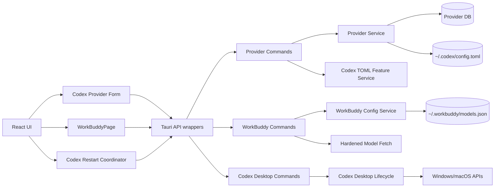

# 02 — 系统架构与详细设计

## 1. 设计原则

1. **按领域隔离。** WorkBuddy 是配置工具，不是现有供应商域的一种 `AppType`。
2. **后端给出事实，前端负责交互。** live 配置是否变化、文件冲突、进程身份和重启结果均由后端判定。
3. **配置即真实来源。** Codex 开关由 TOML 推导；WorkBuddy 更新基于保存瞬间重新读取的 JSON。
4. **非破坏式优先。** 保留 TOML 注释、JSON 未知字段、数组位置和其他请求头。
5. **失败安全。** 不确定进程身份时不关闭；配置损坏时不覆盖；重定向跨源时不发送凭据。
6. **不扩大范围。** 不为 WorkBuddy 建立供应商切换、安装或进程生命周期。

## 2. 当前源码基线映射

### 2.1 顶层应用与导航

| 当前文件 | 当前职责 | 设计影响 |
|---|---|---|
| `src/lib/api/types.ts` | `AppId` 为 8 个供应商型应用联合类型 | 拆分供应商 App ID 与顶层导航 ID |
| `src/config/appConfig.tsx` | `APP_IDS`、图标、MCP/Skills 子集 | WorkBuddy 只加入顶层集合和图标映射，不加入 MCP/Skills |
| `src/components/AppSwitcher.tsx` | 固定应用顺序和显示过滤 | 在 Codex 后插入 WorkBuddy |
| `src/components/settings/AppVisibilitySettings.tsx` | 应用可见性设置 | 新增 WorkBuddy，默认可见 |
| `src/App.tsx` | 根据 `activeApp` 渲染供应商列表及各应用功能 | 为 WorkBuddy 增加独立页面分支，避免进入 `ProviderList` |
| `src-tauri/src/settings.rs` | 后端 `VisibleApps` | 增加 `workbuddy: bool`，默认 `true`，兼容旧设置缺字段 |

### 2.2 Codex 供应商表单与元数据

| 当前文件 | 当前能力 | 设计使用 |
|---|---|---|
| `src/components/providers/forms/ProviderForm.tsx` | 新增/编辑共享表单 | 继续作为入口 |
| `src/components/providers/forms/CodexFormFields.tsx` | Codex 字段、现有高级选项、Switch | 新增“Codex 原生能力”分组 |
| `src/components/providers/forms/hooks/useCodexConfigState.ts` | TOML、Base URL、模型状态 | 接入特性分析/补丁状态 |
| `src/utils/providerConfigUtils.ts` | 前端 TOML 解析/改写辅助 | 不承担最终无损补丁；仅保留无副作用读取或逐步迁移 |
| `src/types.ts` | 前端 `ProviderMeta` | 增加迁移标记与官方能力骨架所有权标记 |
| `src-tauri/src/provider.rs` | 后端 `ProviderMeta`、`ProviderMutationResult` | 增加同名 camelCase 私有标记和可选 warning codes |
| `src-tauri/Cargo.toml` | 已有 `toml_edit = "0.22"` | 使用既有依赖完成保留注释的补丁 |

### 2.3 Provider live 配置链路

| 当前文件 | 设计影响 |
|---|---|
| `src/lib/api/providers.ts` | Provider 写操作返回值应携带 live 变化结果 |
| `src/hooks/useProviderActions.ts` | 统一接入 Codex 重启协调器，不再只显示静态 toast |
| `src-tauri/src/commands/provider.rs` | 将服务结果映射为结构化 mutation result |
| `src-tauri/src/services/provider/mod.rs` | 负责数据库操作与 live 同步事实 |
| `src-tauri/src/services/provider/live.rs` | 在写入前后计算 live 内容变化 |
| `src-tauri/src/codex_config.rs` | 继续负责用户级 Codex 配置写入，补充结果摘要 |

### 2.4 Codex 桌面应用

现有模块：

- `src/components/codex/CodexDesktopInstallerCard.tsx`
- `src/hooks/useCodexDesktopInstaller.ts`
- `src/lib/api/codex-desktop.ts`
- `src-tauri/src/commands/codex_desktop.rs`
- `src-tauri/src/services/codex_desktop/mod.rs`
- `src-tauri/src/codex_desktop/platform.rs`
- `src-tauri/src/codex_desktop/platform/macos/*`
- `src-tauri/src/codex_desktop/platform/windows/*`
- `src-tauri/src/codex_desktop/verify.rs`
- `src-tauri/src/codex_desktop/runtime.rs`

当前具备可信安装检测、安装和启动；缺少运行状态、正常退出、强制终止、等待退出和重启编排。设计在同一可信身份边界内扩展，不创建通用“按名称杀进程”接口。

### 2.5 模型获取与文件写入

- `src-tauri/src/services/model_fetch.rs` 会构造多个候选 URL、要求 Key 非空并按 ID 排序，不符合 WorkBuddy 规则；应建立独立服务。
- `src-tauri/src/proxy/http_client.rs` 已包含全局/系统代理决策，可抽取为受限客户端共享的代理配置构造器。
- `src-tauri/src/config.rs::atomic_write` 在 Windows 上先删除目标再重命名，只是“尽量接近原子性”；凭据文件需要新的严格替换原语。

## 3. 目标架构



## 4. 类型边界

### 4.1 前端应用 ID

推荐将当前 `AppId` 明确为供应商域：

```ts
export type ProviderAppId =
  | "claude"
  | "claude-desktop"
  | "codex"
  | "gemini"
  | "grokbuild"
  | "opencode"
  | "openclaw"
  | "hermes";

export type TopLevelAppId = ProviderAppId | "workbuddy";
```

适用规则：

- `AppSwitcher`、顶部导航和可见性使用 `TopLevelAppId`；
- Provider、MCP、Skills、Prompt、Profile、当前供应商和用量 API 继续只接受 `ProviderAppId`；
- `activeApp === "workbuddy"` 时直接渲染 `WorkBuddyPage`，不调用 Provider hooks；
- `APP_IDS` 可改名为 `PROVIDER_APP_IDS`，另设 `TOP_LEVEL_APP_IDS`；
- `MCP_APP_IDS`、`SKILLS_APP_IDS` 不包含 WorkBuddy。

这样可以由 TypeScript 编译器阻止将 WorkBuddy 误传到供应商命令。

### 4.2 后端 `AppType`

后端现有 `AppType` 不增加 WorkBuddy。WorkBuddy 命令不接收通用 `app` 参数，使用专用命令：

```text
get_workbuddy_status
fetch_workbuddy_models
save_workbuddy_models
```

这避免在设置、当前供应商、Provider Service、MCP/Skills、用量和代理逻辑中增加无效枚举分支。

## 5. Codex TOML 特性服务

### 5.1 服务边界

后端纯配置服务位于：

```text
src-tauri/src/codex_config.rs
```

对前端暴露两个不落盘的草稿命令：

```rust
analyze_codex_provider_features(app: "codex", provider, isNew)
patch_codex_provider_features(app: "codex", provider, intent, isNew)
```

目的：

- 使用 `toml_edit::DocumentMut` 保留装饰信息；
- 同一套语义同时服务 UI 双向状态和保存校验；
- 避免前端 `smol-toml` 重序列化导致注释丢失；
- 命令只处理字符串草稿，不写用户文件。

### 5.2 分析结果

```ts
interface CodexProviderFeatureState {
  applicable: boolean; // 合法 TOML 对所有 Codex Provider 均为 true
  imageExtension:
    | { kind: "on" }
    | { kind: "off" }
    | { kind: "legacyPendingOn" }
    | { kind: "conflict"; key: string }
    | { kind: "invalid"; code: string };
  websockets: {
    enabled: boolean;
    compatible: boolean;
    reason?: string;
  };
  providerTableFound: boolean;
  diagnostics: ConfigDiagnostic[];
}
```

### 5.3 生图状态算法

目标键：`x-openai-actor-authorization`；匹配使用 ASCII 大小写不敏感。

1. 扫描目标 Provider 的 `http_headers`。
2. 无同名键：
   - 固定官方 Provider → `off`；
   - 其他 Provider 且 `imageExtensionConfigured == true` → `off`；
   - 元数据缺失且为历史 Provider → `legacyPendingOn`；
   - 其他新建草稿 → 逻辑默认 `on`，只在正常保存时注入。
3. 恰好一个同名键且值为 `local-image-extension` → `on`。
4. 同名键值不同，或存在多个大小写变体 → `conflict`。
5. TOML 结构不是 map/string → `invalid`。

冲突或字段非法时不得由普通保存自动写入或删除：

- 保持原头；
- 不把冲突解释为本功能开启；
- 历史迁移元数据保持未完成，避免掩盖冲突；
- UI 明确说明操作对应开关会执行受控修复，不回显敏感值。

### 5.4 补丁算法

**开启生图：**

- 无 `http_headers` 时创建内联表或保持当前表风格；
- 合法字符串映射中保留其他头，删除全部大小写变体并插入唯一规范键；
- 已有目标值时幂等；
- 冲突时由该明确开关动作规范化；非法映射则整体替换为只含受管头的新映射。

**关闭生图：**

- 删除所有大小写不敏感匹配的同名键，不区分旧值；
- 映射因此为空时删除 `http_headers`；
- 非字符串映射由该明确关闭动作整体删除。

**WebSocket：**

- 任意 API 格式、供应商身份与代理状态下开启：设置布尔 `true`；
- 关闭：删除字段；
- 非布尔旧字段在普通保存时保留，明确开启时覆盖、明确关闭时删除；
- API 格式切换只重新分析草稿，不修改该字段。

整份 TOML 无法解析是唯一能力写入门禁：开关保持可见但禁用，不尝试重建文档。字段级异常仅形成非敏感诊断。

### 5.5 元数据

前后端 `ProviderMeta` 增加：

```ts
imageExtensionConfigured?: boolean;
codexNativeCapabilitiesGeneratedProvider?: boolean;
```

```rust
#[serde(
  rename = "imageExtensionConfigured",
  skip_serializing_if = "Option::is_none"
)]
pub image_extension_configured: Option<bool>;

#[serde(
  rename = "codexNativeCapabilitiesGeneratedProvider",
  skip_serializing_if = "Option::is_none"
)]
pub codex_native_capabilities_generated_provider: Option<bool>;
```

`imageExtensionConfigured` 只解决非官方历史 Provider 中“未迁移”和“明确关闭”都表现为缺少请求头的歧义。官方骨架所有权标记只在能力补丁确实新建 Provider 表时设置；已有但未激活的 `custom` 表可以复用，但不得被本功能认领。该标记只允许在形状再次核验后参与清理，不能单独授权删除 TOML。

固定官方 Provider 空配置时不创建表。首次实际开启能力才生成 `custom` 表：`name = "OpenAI"`、`requires_openai_auth = true`、`wire_api = "responses"`，并只写入开启的能力。两个能力都关闭且表仍为精确受管形状时删除骨架；用户增加过任何字段时保留表。显式 `model_provider` 使统一会话历史注入直接跳过。

## 6. Codex 表单交互

### 6.1 组件结构

在 `CodexFormFields.tsx` 现有高级选项中加入：

```text
Codex 原生能力
├─ 启用内置生图扩展
│  ├─ 默认/迁移说明
│  └─ 请求头诊断与主动修复说明
└─ 启用 WebSocket 传输
   └─ 上游模型/代理可能不支持的风险说明
```

建议抽出：

```text
src/components/providers/forms/codex/CodexNativeCapabilities.tsx
src/hooks/useCodexProviderFeatures.ts
```

Hook 负责：

- 分析 TOML 草稿；
- 调用后端补丁命令；
- 消除过期响应（sequence ID / abort）；
- 维护迁移/冲突状态；
- 触发表单 dirty；
- 保存前再次分析校验。

所有 Codex 分类复用该组件，能力分组本身不按 Provider ID、URL、凭据、OAuth、API 格式或代理状态分支。高级区初始折叠；固定官方表单只新增这两个高级控件，其余第三方高级字段不外露。整份 TOML 无效时禁用两个开关，字段级异常时仍可操作。

### 6.2 双向同步

- 表单加载：分析 TOML 和元数据；
- 操作开关：后端返回补丁后的完整草稿；
- 手工编辑 TOML：防抖分析，更新开关；
- 保存：以后端最终分析结果为准；
- 不应在每次按键时写 live 文件或数据库。

## 7. Provider 写操作与 live 变化

### 7.1 统一返回模型

定义通用结果：

```ts
interface ProviderMutationResult<T = void> {
  value: T;
  liveConfigChanged: boolean;
  app: ProviderAppId;
  warningCodes?: (
    | "CODEX_WEBSOCKET_NON_GPT_MODEL"
    | "CODEX_WEBSOCKET_PROXY_MAY_BE_UNSUPPORTED"
  )[];
}
```

后端可附加内部摘要：

```rust
pub struct LiveSyncResult {
    pub changed: bool,
    pub before_digest: Option<String>,
    pub after_digest: Option<String>,
}
```

摘要不得包含配置内容或凭据，前端无需接收 digest。

Codex 添加/更新成功后，命令层重新读取最终落库 Provider，再计算 warning codes。只有显式 `supports_websockets = true` 才检查：顶层 `model`、`review_model`、`modelCatalog.models[].model` 中任一非空模型取最后 `/` 段后不以大小写不敏感的 `gpt-` 开头，则返回模型风险；无可识别模型不警告。当前 Codex 代理接管开启则追加代理风险。切换命令和失败结果不返回这些风险。

renderer 将一项或两项风险合并为一条本地化 warning toast，并替换普通成功 toast；风险未消失时每次添加/编辑成功都提示，不保存“已提示”状态。

代理接管投影仍以本地 Responses 路由为客户端入口：普通 Provider 只改写路由所需的 `base_url`、`wire_api` 和既有上游模型字段，保留显式 WebSocket 与受管生图头；固定官方 Provider 生成 `fyagent-official` 路由时从原草稿复制这两个能力，不再固定关闭 WebSocket。关闭接管后从可信备份或 Provider 单一事实源恢复。代理服务本身仍仅处理 HTTP/SSE，没有 WebSocket Upgrade 路由；该限制由保存警告表达，不在投影层篡改用户配置。

### 7.2 判定方式

- 操作前读取 live 文件字节；不存在视为空状态；
- 执行现有同步逻辑；
- 操作后读取最终字节；
- 比较内容摘要/字节；
- 只有成功写入且内容不同，`liveConfigChanged = true`；
- 数据库变化但 live 未变为 `false`；
- 同一复合操作聚合为一个布尔结果。

该判定应放在服务层，不由前端推断“当前供应商 ID”。

## 8. Codex 重启协调器

### 8.1 前端

新增：

```text
src/hooks/useCodexRestartCoordinator.ts
src/components/codex/CodexRestartDialog.tsx
```

调用协议：

1. Provider 写操作成功；
2. `liveConfigChanged == false` → 普通成功提示；
3. `true` → 查询可信 Codex 运行状态；
4. 未运行/不支持/身份歧义 → 不弹重启框，给相应提示；
5. 唯一可信运行实例 → 弹出重启询问；
6. 用户确认 → 调用重启流程；
7. 需要强制关闭时，后端返回 `forceConfirmationRequired`，前端显示第二确认；
8. 最终区分配置结果与重启结果。

### 8.2 后端命令

建议扩展现有 `codex_desktop` 命令集：

```text
get_codex_desktop_runtime_status
request_codex_desktop_restart
continue_codex_desktop_restart_with_force
```

不暴露任意 PID 或进程名终止命令。

### 8.3 状态模型

```rust
enum CodexDesktopRuntimeStatus {
    NotInstalled,
    NotRunning { installation: TrustedInstallation },
    Running { installation: TrustedInstallation, instances: Vec<TrustedInstance> },
    Ambiguous { reason: String },
    Unsupported,
}

enum RestartOutcome {
    Restarted,
    ForceConfirmationRequired { token: OpaqueRestartToken },
    Cancelled,
    Failed { phase: RestartPhase, message: String },
}
```

强制继续使用一次性、短期、进程内 token，绑定最初解析的可信安装与实例，防止前端传入任意 PID。

### 8.4 Windows

设计流程：

- 复用现有包清单/安装验证，确定可信包身份和可执行路径；
- 枚举属于该可信包的运行进程，不按名称通配；
- 对其顶层窗口发送正常关闭请求；
- 等待进程组最多 8 秒；
- 需要强制时，使用受控句柄终止已绑定实例；
- 确认旧实例退出；
- 复用现有可信启动适配器激活应用；
- 最多 15 秒重新枚举可信实例；
- 只有新实例出现才返回 `Restarted`。

如果身份或安装唯一性不足，返回 `Ambiguous`，不执行关闭。

### 8.5 macOS

- 复用现有 Bundle 验证得到 Bundle ID 和 Bundle URL；
- 使用 `NSRunningApplication.runningApplications(withBundleIdentifier:)` 获取候选；
- 比对 `bundleURL`/`executableURL` 与可信安装路径；
- 唯一后调用正常 `terminate()`；
- 等待最多 8 秒；
- 强制确认后调用 `forceTerminate()`；
- 使用可信 Bundle URL 启动；
- 最多 15 秒确认匹配实例出现且完成启动。

Bundle ID 相同但路径不同或多安装无法消歧时，不自动退出。

### 8.6 失败语义

- 配置保存和重启是两个独立结果；
- 重启失败不得回滚 TOML；
- 错误对象包含阶段：detect、quit、force-quit、launch、verify；
- 错误不输出敏感配置；
- 用户可按提示手动重启。

## 9. WorkBuddy 前端设计

### 9.1 文件结构

```text
src/pages/workbuddy/WorkBuddyPage.tsx
src/components/workbuddy/WorkBuddyConnectionForm.tsx
src/components/workbuddy/WorkBuddyModelSelector.tsx
src/components/workbuddy/WorkBuddySaveConflictDialog.tsx
src/hooks/useWorkBuddyConfig.ts
src/lib/api/workbuddy.ts
src/lib/query/workbuddy.ts
src/types/workbuddy.ts
src/assets/workbuddy-icon-512.png
```

页面不复用 ProviderForm，避免其当前供应商、切换、用量和数据库语义泄漏。

### 9.2 页面状态

```ts
interface WorkBuddyFormState {
  rawUrl: string;
  apiKey: string;
  allowEmptyApiKey: boolean;
  clearExistingApiKeys: boolean;
  fetchedModels: Array<{ id: string; selected: boolean }>;
  manualModelsText: string;
  statusRevision?: string;
}
```

API Key 只存在组件内存状态；离开页面或关闭窗口即清除。

### 9.3 获取模型交互

- URL/Key 校验通过后才可点击；
- 请求中禁用重复点击；
- 成功后全部 `selected = true`；
- “全选”只作用于当前获取结果；
- “取消全选”不清除列表和手动输入；
- 新一轮获取成功替换旧获取结果，手动输入保留；
- 显示总数和已选数；
- 1000 上限在后端执行，前端只显示结构化结果。

### 9.4 保存交互

1. 本地构造最终模型 ID 顺序；
2. 校验至少一个模型；
3. 调用保存命令，携带页面状态 revision；
4. 若返回重复目标冲突：展示 ID、次数及“覆盖不会去重”说明；
5. 用户确认覆盖后，用后端给出的 opaque conflict token 或重新提交 `duplicatePolicy=updateAll`；后端仍需重新读取并验证 revision；
6. 若存在旧非空 Key 且输入空：要求 `clearExistingApiKeys` 显式确认；
7. 成功后清空 API Key 输入，刷新状态 revision 和模型计数；
8. 仅显示“配置已保存”。

## 10. WorkBuddy 后端设计

### 10.1 模块

```text
src-tauri/src/commands/workbuddy.rs
src-tauri/src/services/workbuddy/mod.rs
src-tauri/src/services/workbuddy/config.rs
src-tauri/src/services/workbuddy/model_fetch.rs
src-tauri/src/services/workbuddy/url.rs
src-tauri/src/services/workbuddy/types.rs
```

在 Tauri command registry 注册专用命令，不改 `AppType`。

### 10.2 命令契约

```rust
get_workbuddy_status() -> WorkBuddyStatus
fetch_workbuddy_models(request: FetchWorkBuddyModelsRequest) -> FetchResult
save_workbuddy_models(request: SaveWorkBuddyModelsRequest) -> SaveResult
```

`WorkBuddyStatus` 不返回任何模型内容或 Key：

```rust
struct WorkBuddyStatus {
    path: String,
    exists: bool,
    model_count: usize,
    revision: Option<String>,
    backup_exists: bool,
}
```

### 10.3 URL 服务

单一 `normalize_workbuddy_base_url` 同时服务获取和保存，返回：

```rust
struct NormalizedWorkBuddyUrl {
    base_url: Url,
    models_url: Url,
    insecure_transport_warning: bool,
    origin: OriginKey,
}
```

禁止前后端分别实现不同 URL 拼接规则；前端可做即时提示，但后端结果为最终依据。

### 10.4 模型获取服务

不复用当前 `services/model_fetch.rs` 的候选回退和排序逻辑。独立客户端：

- 从现有代理模块取得只读代理策略；
- 自定义 redirect policy；
- 每次请求创建短生命周期 client；
- 对响应流计数，达到 2 MiB 即中止；
- 解析 `data[].id`；
- trim、过滤空 ID、按首次顺序去重；
- 1000 后停止或返回明确上限错误；建议返回前 1000 并标记 `truncated=true`，UI 需提示；
- 错误体最多保留小段可打印文本，经过 Key/URL userinfo 脱敏。

### 10.5 配置服务

- 使用进程内异步互斥锁串行化本应用的 WorkBuddy 写操作；
- 保存时重新读取文件；
- 校验 revision，发现外部变化则拒绝；
- 解析为带 `flatten` 扩展字段的模型结构；
- 扫描重复目标；
- 根据 duplicate policy 执行 upsert；
- 生成格式化 JSON；
- 先更新固定备份，再原子替换主文件；
- 成功后返回新 revision、模型总数、创建/更新数。

## 11. 设置迁移与兼容

### 11.1 VisibleApps

后端 `VisibleApps` 增加：

```rust
#[serde(default = "default_true")]
pub workbuddy: bool,
```

前端对应字段可选读取时默认 `true`。旧设置文件缺字段时 WorkBuddy 默认显示，不需要批量迁移文件。

### 11.2 ProviderMeta

新可选字段不会破坏旧记录；缺失用于识别历史未迁移。导入/导出 Provider 时应保留该字段。

### 11.3 WorkBuddy JSON

- 目标 Schema 以项目方真实配置为基线；
- 根数组外的格式不迁移；
- 未知字段保留；
- `onlyReasoning` 是唯一明确清理的兼容字段；
- 不检测 WorkBuddy 版本。

## 12. 国际化

新增键覆盖：

- WorkBuddy 应用名称、页面字段、文件状态；
- 允许无 Key、清空旧 Key；
- 获取、全选、取消全选、已选数量；
- URL/HTTP/TLS/响应格式错误；
- 重复 ID 冲突及覆盖说明；
- Codex 两个开关、迁移、字段诊断，以及非 GPT/代理链路保存风险；
- 重启询问、强制退出确认、各阶段失败。

必须更新项目现有简中、繁中、英文和日文资源，不能依赖中文 fallback。

## 13. 图标应用

- 将 512 PNG 放入前端 assets，作为主源；
- 切换器和设置列表使用统一图片组件，尺寸 14–20 px；
- 保持 `object-fit: contain`，不再次裁剪；
- 不加载远程 URL；
- 深色主题仍使用资产自身白色图标底，避免内部白色猫形被当作透明背景；
- 256 WebP 可用于需要较小包体的场景，二者视觉应一致。

## 14. 可观测性

允许日志：

- 命令名、阶段、状态码、耗时、模型数量、文件路径的用户主目录缩写；
- live 配置是否变化；
- 进程生命周期阶段和可信身份摘要。

禁止日志：

- API Key；
- Authorization；
- 完整 WorkBuddy JSON；
- 包含凭据的 URL；
- Codex 配置正文；
- 供应商自定义头的敏感值。

## 15. 外部技术依据

- Codex 官方将 `http_headers` 和 `supports_websockets` 定义在 `model_providers.<id>`；FyAgent 允许跨 API 格式保存该字段，不等于对特定模型、第三方上游或本地代理能力作出保证。
- Codex 官方说明供应商定义属于用户级配置，项目级配置不能覆盖 `model_providers`。
- WorkBuddy 官方说明配置和 API Key 仅本地保存，并支持标准 `/chat/completions` 自动补全。
- Apple `NSRunningApplication` 提供按 Bundle ID 获取运行应用以及 Bundle URL/启动状态等身份信息。
- RFC 9110 将认证凭据与 origin/protection space 联系起来；本设计进一步采用同源重定向和禁止降级的保守策略。

资料链接见 `README.md`。
