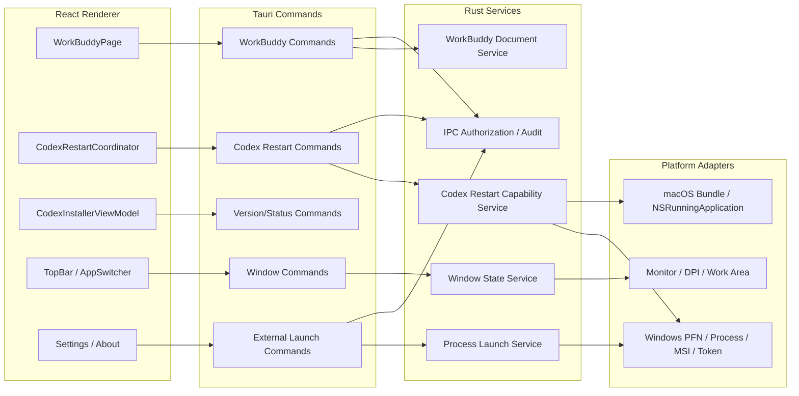
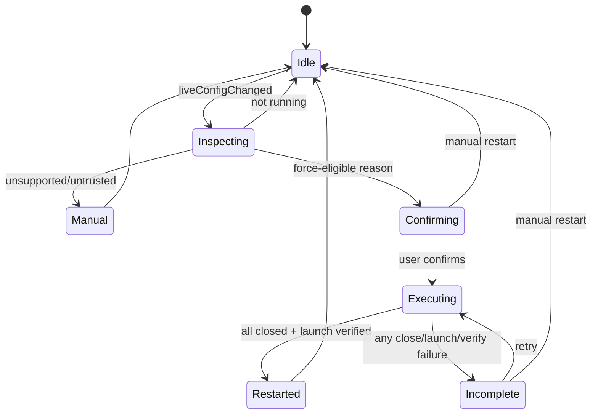

# 04 — 系统架构与 IPC 设计

## 1. 设计目标

本设计将本次需求拆分为六个边界清晰的子系统：

1. Codex 重启能力服务；
2. WorkBuddy 配置文档服务；
3. Codex 版本字段视图模型；
4. 顶部栏容量与窗口状态服务；
5. Windows 提权运行与外部进程权限服务；
6. IPC 命令授权与诊断体系。

共同要求：平台事实只在 Rust 后端判定；前端只能获得渲染和用户决策所必需的脱敏 DTO。

## 2. 目标架构概览



## 3. 前后端职责

| 事项 | 前端 | 后端 |
|---|---|---|
| 是否真实改变 live Codex 配置 | 不判断 | 返回结构化事实 |
| Codex 候选身份与进程集合 | 不接触 | 枚举、验证、去重 |
| 多安装优先级 | 不选择 | 固定比较器自动选择 |
| 强制重启风险确认 | 展示并收集用户决定 | 生成/消费短期能力令牌 |
| WorkBuddy 已有 ID | 展示、过滤 | 解析、去重、保序 |
| WorkBuddy 覆盖集合 | 展示确认 | 在最新 revision 上计算 |
| API Key | 页面内存 | 仅命令调用期间和目标文件写入使用 |
| 版本字段状态 | 渲染判别联合 | 返回原始查询结果/错误分类 |
| 顶部栏容量 | 测量与布局 | 提供窗口工作区和尺寸约束 |
| 外部进程权限 | 请求明确动作 | 决定提升/非提升启动 |
| IPC 授权 | 不构成安全边界 | 参数、状态、能力令牌复验 |

## 4. WorkBuddy IPC

### 4.1 保持状态接口最小化

现有 `get_workbuddy_status` 继续只返回非敏感元数据：

```ts
interface WorkBuddyStatus {
  path: string;
  exists: boolean;
  modelCount: number;      // 唯一 ID 数量
  revision: string | null;
  backupExists: boolean;
  format: "legacyArray" | "objectRoot" | "missing";
}
```

`modelCount` 从原始条目数修订为静默去重后的唯一 ID 数量。若需保留内部原始条目数，只能放入后端诊断，不进入普通 DTO。

### 4.2 新增已有模型 ID 命令

建议命令：

```text
get_workbuddy_model_ids
```

返回：

```ts
interface WorkBuddyModelIdsResult {
  ids: string[];           // 第一次出现顺序、大小写原样、静默去重
  revision: string | null;
}
```

安全约束：

- 不返回完整模型对象；
- 不返回 URL、API Key、Vendor 或能力；
- 不接受文件路径参数；
- 路径仍由后端固定解析为当前用户 WorkBuddy 配置路径。

### 4.3 保存请求

建议将当前 `DuplicatePolicy` 重命名为覆盖语义：

```ts
interface SaveWorkBuddyModelsRequest {
  baseUrl: string;
  apiKey: string;
  allowNoApiKey: boolean;
  selectedModelIds: string[];
  manualModelIds: string[];
  clearExistingApiKeys: boolean;
  expectedRevision: string | null;
  overwriteToken?: string;
}
```

不建议仅使用布尔 `overwriteExisting=true`，因为用户确认和文件 revision 之间存在竞态。更可靠的是后端在第一次冲突响应时生成短期、不透明、一次性覆盖能力令牌。

### 4.4 保存结果判别联合

```ts
type SaveWorkBuddyModelsOutcome =
  | {
      state: "saved";
      revision: string;
      modelCount: number;
      createdEntries: number;
      updatedEntries: number;
    }
  | {
      state: "overwrite_confirmation_required";
      token: string;
      existingIds: string[];
    }
  | {
      state: "concurrent_modification";
    };
```

`existingIds`：

- 仅唯一 ID；
- 按请求目标顺序；
- 不返回重复条目数量；
- 不返回原对象内容。

覆盖令牌内部绑定：

```text
规范化目标 ID 列表
expected revision
规范化 Base URL 摘要
API Key 是否为空（不包含 Key 本身）
clearExistingApiKeys
过期时间
随机 nonce
```

前端仍需重新提交原不可变请求；后端验证请求摘要与令牌绑定值一致。

### 4.5 WorkBuddy 错误码调整

建议废弃或兼容映射：

```text
WORKBUDDY_CONFIG_ROOT_NOT_ARRAY
WORKBUDDY_CONFIG_DUPLICATE_TARGET
```

新增：

```text
WORKBUDDY_CONFIG_ROOT_UNSUPPORTED
WORKBUDDY_CONFIG_MODELS_NOT_ARRAY
WORKBUDDY_CONFIG_EXISTING_TARGET
WORKBUDDY_OVERWRITE_TOKEN_INVALID
WORKBUDDY_OVERWRITE_TOKEN_EXPIRED
WORKBUDDY_CONFIG_CONCURRENT_MODIFICATION
WORKBUDDY_CONFIG_INVALID_ENTRY
```

前端只用本地化 `messageKey`，不得直接展示后端原始字符串。

## 5. Codex 重启后端模型

### 5.1 将“唯一目标”改为“候选计划”

当前抽象大致为：

```text
Unique target | Ambiguous | Not running
```

目标抽象：

```rust
struct RestartPlan {
    app_identity: ExactAppIdentity,
    installations: Vec<TrustedInstallationCandidate>,
    selected_installation: StableInstallationKey,
    runtime_instances: Vec<TrustedRuntimeInstance>,
    reason: RestartReason,
    plan_revision: String,
}
```

内部类型建议：

```rust
enum ExactAppIdentity {
    WindowsPackageFamilyName(String),
    MacBundleIdentifier(String),
}

enum RestartReason {
    UniqueRuntime,
    MultipleInstances,
    MultipleInstallations,
    IdentityBindingAmbiguous,
}
```

`TrustedRuntimeInstance` 继续为平台私有类型，可能包含：

- Windows：PID、进程创建时间、进程句柄证据、PFN、归属安装；
- macOS：PID、启动时间、Bundle URL、Bundle ID、运行应用引用；
- 前端永远看不到这些字段。

### 5.2 安装选择比较器

比较器必须是纯函数并覆盖单元测试：

```text
running desc
version desc
scope: system before user
stableIdentity asc
```

版本比较使用平台结构化版本，不使用普通字符串字典序。无法比较的版本统一排在已知版本之后，再用稳定标识排序。

### 5.3 运行实例枚举

Windows：

1. 以精确 PFN 枚举相关进程；
2. 获取进程创建时间，形成防 PID 复用证据；
3. 顶层窗口只用于归并/辅助，不再要求恰好一个窗口；
4. 按 `(pid, creation_time)` 去重；
5. 不匹配 PFN 的进程完全排除。

macOS：

1. 按精确 Bundle Identifier 获取运行应用；
2. 记录 PID、启动时间和可用 Bundle URL；
3. 不以系统返回数组顺序决定优先级；
4. 同 Bundle ID 的全部运行应用进入关闭集合；
5. 安装验证仍可保持现有更强校验，但本次强制关闭最低门槛按已确认决策使用精确 Bundle ID。

### 5.4 询问 DTO

```ts
type CodexRestartPromptReason =
  | "multiple_instances"
  | "multiple_installations"
  | "identity_binding_ambiguous";

interface CodexRestartPrompt {
  state: "confirmation_required";
  reason: CodexRestartPromptReason;
  token: string;
}
```

不返回数量、版本、安装范围、路径或标识。

若未运行：

```ts
{ state: "not_running" }
```

若不可信：

```ts
{ state: "manual_restart_required", reason: "untrusted_target" | "unsupported" }
```

### 5.5 一次确认能力令牌

令牌应：

- 随机且不可猜测；
- 短期有效；
- 一次性消费；
- 绑定 exact app identity、所选安装稳定键、操作类型和计划 revision；
- 不把 PID 或路径编码到可解析 token；
- 只保存在后端受锁状态表。

前端只原样回传：

```text
force_restart_codex_desktop(token)
```

### 5.6 执行算法

```text
consume token
→ re-enumerate exact identity installations and runtime instances
→ rebuild plan using fixed comparator
→ validate selected installation exists and is launchable
→ force-close every exact-matching deduplicated runtime instance
→ wait until all targeted instances exit
→ if any failure: return incomplete, launch count = 0
→ launch selected installation exactly once as ordinary interactive user where required
→ wait for one new exact-matching runtime instance
→ return restarted
```

重要边界：

- 关闭前先验证安装，避免关完后无可启动目标；
- 运行集合变化不要求第二次确认；
- 无运行实例时跳过关闭并继续启动；
- 自动优先级变化按最新集合重新计算并继续；
- PID 复用必须通过创建时间或平台等效证据排除；
- 等待终止后才能启动，因为强制终止 API 调用返回不代表进程已完全退出。

### 5.7 结果 DTO

```ts
type CodexForceRestartOutcome =
  | { state: "restarted" }
  | { state: "incomplete"; retryToken: string }
  | { state: "manual_restart_required" }
  | { state: "cancelled" };
```

普通 UI 对 `incomplete` 不读取技术详情。内部诊断可记录：

```text
reason code
phase
candidate counts
failure class
platform error code
```

但必须脱敏，不记录 PID、完整路径或用户标识。

`retryToken` 可省略，由前端再次调用“准备重启”重新生成确认能力；由于用户已确认过风险，建议专用 `retry_force_restart` 命令重新枚举并直接执行，仍需一次性后端能力状态，避免前端获得通用终止权限。

## 6. Codex 重启状态机



前端 `dialogOpenRef` 等防重逻辑可以保留，但状态类型应从 `restart | force` 改为：

```ts
| { kind: "confirm"; token: string; reason: CodexRestartPromptReason }
| { kind: "progress" }
| { kind: "incomplete" }
| null
```

## 7. 版本字段视图模型

Hook 应将 TanStack Query 状态映射为稳定 UI 契约：

```ts
interface CodexDesktopInstallerViewModel {
  localVersion: LocalVersionState;
  remoteVersion: RemoteVersionState;
  canInstall: boolean;
  canUpdate: boolean;
  canLaunch: boolean;
  canRetryRemote: boolean;
  statusMessageKey: string;
}
```

映射原则：

```text
remote data undefined + isLoading     -> loading
remote data exists + isRefetching     -> refreshing
remote data exists + isRefetchError   -> refetch_error
no data + network/source error         -> initial_network_error
release not available for platform    -> platform_unavailable
metadata validation error             -> metadata_error
```

按钮可用性必须由状态计算，不在组件 JSX 中重复散落条件。

## 8. 顶部栏组件架构

### 8.1 组件拆分

```text
TopLevelHeader
├─ BrandSlot
├─ PriorityControlsSlot       // P1
├─ ContextOverflowSlot        // P2 + TopMore
├─ AppSwitcherCapacitySlot    // flex-1 min-w-0
└─ TrailingPrimaryActionSlot  // fixed width, shrink-0
```

Provider：

```tsx
<TrailingPrimaryActionSlot>
  <AddProviderButton />
</TrailingPrimaryActionSlot>
```

WorkBuddy：

```tsx
<TrailingPrimaryActionSlot>
  <span aria-hidden="true" className="pointer-events-none" />
</TrailingPrimaryActionSlot>
```

槽宽使用一个共享常量或由实际按钮测量后固定，不能在两个分支分别复制 magic number。

### 8.2 AppSwitcher 容量算法

复用“父槽宽度 + ResizeObserver + More”思路：

1. 测量父级可用宽度，而不是组件当前自身宽度；
2. 预先获得每个应用按钮宽度和 More 宽度；
3. 当前应用必须在可见集合；
4. 正常模式当前九个应用全部可见；
5. 受限模式按稳定顺序收纳非当前应用；
6. More 菜单保留完整应用名称、图标和 active 状态；
7. 避免测量结果影响自身宽度后反复收缩的反馈环。

### 8.3 P2 TopMore

P2 操作应由描述数组驱动：

```ts
interface HeaderActionDescriptor {
  id: string;
  label: string;
  icon: ReactNode;
  onSelect: () => void;
  visible: boolean;
  priority: "p1" | "p2";
}
```

同一个 descriptor 可以渲染为直接按钮或 More 菜单项，避免两套事件和权限逻辑。

### 8.4 目标最小宽度

生成脚本/测试夹具输出：

```json
{
  "layoutVersion": 2,
  "requiredContentWidth": 1232,
  "safetyMargin": 32,
  "targetMinWidth": 1264,
  "defaultWidth": 1344
}
```

数字仅为格式示例，最终值必须由测试测量产生。生产运行时读取提交后的版本化常量，不实时接受任意 DOM 测量结果改变产品最小宽度。

## 9. 窗口状态服务

建议 Rust/前端联合服务：

```text
WindowLayoutPolicy
- target_min_width
- default_width
- default_height
- layout_version
```

启动流程：

```text
create hidden window
→ skip automatic main-window restore
→ read saved state
→ determine target monitor
→ convert workArea physical pixels / scaleFactor to logical pixels
→ calculate effective min size
→ clamp size and position
→ apply min size
→ restore maximized last
→ show window
```

运行时：

- 监听 move、scale change、display change；
- 100–250ms 合并连续事件；
- 重新计算有效 min size；
- 向前端发出 `layout-mode-changed`：`normal | constrained`；
- 诊断只记录逻辑工作区宽度、scale factor 和模式，不记录显示器序列号。

## 10. Windows 构建与运行架构

### 10.1 构建配置分离

建议至少两个 Windows 清单构建配置：

| 构建 | 执行级别 | 用途 |
|---|---|---|
| dev/test | `asInvoker` | 本地开发、单元、E2E |
| release | `requireAdministrator` | 正式签名安装包 |

两者都保留 Common Controls v6，`uiAccess=false`。

构建后不能只检查 XML 源文件，必须从实际 EXE 提取或验证嵌入清单。

### 10.2 安装器

WiX 目标：

```text
InstallScope=perMachine
InstallPrivileges=elevated
INSTALLDIR default = ProgramFiles\FyAgent
WixUI_InstallDir retained
```

自定义目录验证必须在安装提交前执行，并在失败时显示明确原因。路径验证与 ACL 设置不能只依赖 UI；静默安装和命令行安装也必须执行相同检查。

### 10.3 早期单实例门

由于不增加启动器，UAC 仍发生在进程创建前。主进程开始执行后，最早阶段完成：

```text
acquire named mutex scoped to product/user
if first:
    create locked activation pipe
    continue initialization
else:
    parse only minimal activation envelope
    authenticate pipe endpoint
    forward show/deeplink
    exit before business initialization
```

激活通道要求：

- 名称包含产品固定标识和交互用户 SID 摘要；
- ACL 只允许目标用户、SYSTEM 和管理员；
- 消息有长度和 schema 限制；
- 已有实例再次完整解析深链接；
- 第二进程不打开数据库、不读 API Key、不启动代理。

### 10.4 用户身份校验

提升后获取：

- 交互桌面用户 SID；
- 当前进程主令牌 SID；
- 当前账户是否属于本地 Administrators。

若交互用户与进程用户不是同一账户：

- 不初始化用户配置目录；
- 显示阻塞错误并退出；
- 日志只记录不相等和错误码，不记录 SID 字符串。

## 11. 外部进程权限服务

建立统一抽象：

```rust
enum LaunchPrivilege {
    InteractiveUser,
    Elevated,
}

struct LaunchRequest {
    executable: TrustedExecutable,
    args: Vec<ValidatedArg>,
    working_directory: Option<ValidatedPath>,
    privilege: LaunchPrivilege,
    capture_output: bool,
}
```

公开的业务方法而不是通用任意执行：

```text
open_http_url_as_user
open_directory_as_user
launch_terminal_as_user
launch_editor_as_user
launch_codex_desktop_as_user
run_cli_installer_elevated
run_codex_install_elevated
```

禁止向前端暴露：

```text
run_arbitrary_command(executable, args, privilege)
```

Windows 普通用户启动优先使用 Explorer 代理或受控的交互用户令牌；失败时返回结构化错误，不以管理员权限兜底。

## 12. IPC 安全分类

### 12.1 分类

| 类别 | 示例 | 要求 |
|---|---|---|
| Q0 只读查询 | 版本、状态、已有模型 ID | 固定路径、结果脱敏 |
| Q1 用户数据写入 | Provider/WorkBuddy 保存 | revision、schema、原子写 |
| Q2 敏感凭据 | API Key、OAuth | 日志脱敏、最小生命周期 |
| Q3 外部进程 | 打开浏览器/终端 | 固定业务动词、普通权限默认 |
| Q4 管理员操作 | Codex 安装、ACL | 后端白名单、平台校验 |
| Q5 破坏性操作 | 强制终止、覆盖 | 一次性能力令牌、用户确认 |

### 12.2 令牌通用属性

- 128 bit 以上随机熵；
- 后端状态表保存，前端只拿 opaque string；
- 绑定命令类型和请求摘要；
- 单次消费；
- 过期后失败关闭；
- 应用退出时清空；
- 日志只记录 token 事件 ID，不记录 token 值。

### 12.3 Capability 与 CSP

- 明确列出主窗口需要的插件权限；
- 不依赖 `default` 自动扩大权限；
- 没有远程 WebView 时不配置远程 API 访问；
- 审查 `connect-src` 和 `img-src`，将业务需要的协议和来源最小化；
- 资产协议 scope 保持显式空或最小目录；
- 未使用命令从 `invoke_handler` 删除；
- 每个管理员/破坏性命令增加独立授权测试。

## 13. 深链接边界

保留的导入字段可以包含 API Key，但必须：

- scheme 和版本精确；
- action allowlist；
- 总长度、单字段、字段数、编码层数限制；
- 拒绝控制字符和异常 Unicode；
- URL 查询参数在任何日志中剥离；
- 导入对话框默认遮罩 Key；
- 确认页完整、可滚动地展示将写入的 Prompt 正文，禁止用截断预览隐藏尾部内容；
- Provider 链接的 `enabled=true` 只能提出立即切换/写入 live 配置的请求；确认页必须明确警示，且默认不激活，只有用户勾选独立的显式批准后后端才可切换；未启用时也必须明确显示不自动切换；
- 用户明确确认后才写入；
- 深链接只生成普通业务草稿，不可携带管理员操作令牌；
- 单实例转发后的已有实例重新解析原始消息，不信任第二进程的“已验证”标记。

## 14. 诊断模型

建议统一结构：

```rust
struct DiagnosticEvent {
    event_id: Uuid,
    area: &'static str,
    operation: &'static str,
    outcome: &'static str,
    reason_code: Option<&'static str>,
    phase: Option<&'static str>,
    numeric_metrics: BTreeMap<&'static str, u64>,
}
```

允许：候选数量、耗时、布局逻辑宽度、错误分类。<br>
禁止：API Key、token、PID、完整用户路径、完整深链接、账户名/SID、上游响应正文。

前端用户错误始终使用本地化 key；诊断 event ID 可在“复制诊断信息”中提供，普通错误对话框不必显示。

## 15. 兼容策略

1. 前端旧 `duplicatePolicy` 可在一个版本内由后端兼容反序列化，但新代码不再产生；
2. `CONFIG_ROOT_NOT_ARRAY` 可映射到新的根结构错误文案，避免旧前端完全无法理解；
3. Codex 旧两阶段强制 API 在前后端同时升级，避免一端仍期待 `force_confirmation_required`；
4. Windows 测试构建保持普通权限，避免测试工具链被正式清单阻塞；
5. 旧窗口状态不删除，使用 layout version 和钳制迁移；
6. 旧 per-user 安装只检测并阻止，不尝试跨上下文自动卸载。
