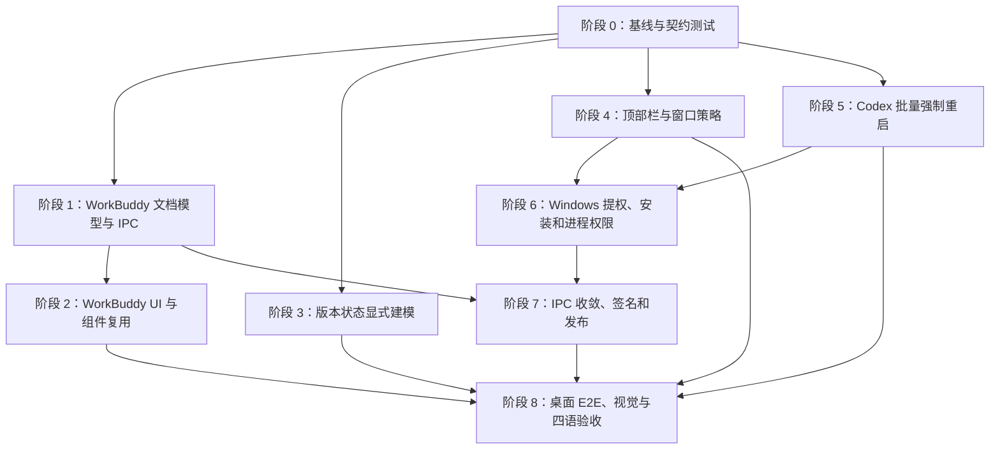

# 06 — 实施顺序与仓库变更地图

## 1. 实施原则

本次改动横跨前端、Rust 服务、平台实现、Windows 安装和测试基础设施。正确顺序应先建立后端事实和类型，再接入 UI，最后改变 Windows 正式权限；不得先把主程序提升为管理员，再补救子进程和 IPC 风险。

实施不按人员或工期拆分，而按依赖和失败隔离拆分。

## 2. 推荐阶段



## 3. 阶段 0：冻结基线与失败测试

目标：在改代码前用测试固定当前问题和新契约。

新增/调整：

- WorkBuddy 对象根当前失败测试；
- 保存后 API Key 当前被清空的组件测试；
- 远程搜索即时过滤和选择语义测试；
- 版本首次加载不得显示“暂不可用/未安装”的组件测试；
- 非唯一 Codex 当前只 Toast 的协调器测试；
- 多实例当前禁止操作的后端测试作为待替换基线；
- 顶部栏 `+` 完整可见和 AppSwitcher 右边缘的桌面 E2E 失败场景；
- Windows release 清单、Portable 和签名门禁的静态检查脚本。

门禁：所有新增测试必须明确失败原因，不能只创建空测试或宽松 snapshot。

## 4. 阶段 1：WorkBuddy 文档模型和 IPC

### 4.1 Rust 服务

优先修改：

```text
src-tauri/src/services/workbuddy/types.rs
src-tauri/src/services/workbuddy/config.rs
src-tauri/src/services/workbuddy/error.rs
src-tauri/src/services/workbuddy/mod.rs
src-tauri/src/commands/workbuddy.rs
```

建议新增：

```text
src-tauri/src/services/workbuddy/document.rs
src-tauri/src/services/workbuddy/overwrite.rs
```

职责拆分：

- `document.rs`：双根解析、模型数组访问、唯一 ID 投影、同形状序列化；
- `overwrite.rs`：覆盖令牌、请求摘要、过期和一次性消费；
- `config.rs`：事务编排、备份和原子替换；
- `types.rs`：新 DTO，移除重复条目数量的公共语义。

关键改动：

1. 将 `LoadedConfig.models` 扩展为保留整个根文档；
2. 替换 `ConfigRootNotArray` 单一错误；
3. 将 `target_duplicate_ids(count > 1)` 改为 `existing_target_ids(count >= 1)`；
4. 拆分 `create_managed_model` 和 `patch_existing_connection_fields`；
5. 保留 current revision 和 atomic write；
6. 新增 `get_workbuddy_model_ids`；
7. `model_count` 改为唯一 ID 数量；
8. 实现 `availableModels` 增量维护。

### 4.2 前端 API

修改：

```text
src/lib/api/workbuddy.ts
src/lib/query/workbuddy.ts
src/lib/api/index.ts
```

建议：

- 新增 `workBuddyKeys.modelIds()`；
- Status 与 IDs 分开缓存；
- Query data 不含 API Key；
- 旧 `Duplicate*` 类型迁移为 `ExistingModel*`/`Overwrite*`；
- 错误解析继续只接受结构化 payload。

阶段通过条件：Rust 表驱动测试覆盖 [05](./05-WorkBuddy数据模型与安全设计.md) 的全部不变量。

## 5. 阶段 2：WorkBuddy UI 和复用

修改：

```text
src/components/workbuddy/WorkBuddyPage.tsx
src/components/workbuddy/WorkBuddyDuplicateConflictDialog.tsx
src/i18n/locales/zh.json
src/i18n/locales/zh-TW.json
src/i18n/locales/en.json
src/i18n/locales/ja.json
```

建议重命名：

```text
WorkBuddyDuplicateConflictDialog.tsx
→ WorkBuddyOverwriteConfirmDialog.tsx
```

建议新增：

```text
src/components/workbuddy/WorkBuddyStatusCard.tsx
src/components/workbuddy/WorkBuddyExistingModelsCard.tsx
src/components/workbuddy/WorkBuddyConnectionCard.tsx
src/components/workbuddy/WorkBuddyRemoteModelsCard.tsx
src/components/model-selection/ModelSearchInput.tsx
src/components/model-selection/ModelSelectionToolbar.tsx
src/components/model-selection/useFilteredSelection.ts
```

复用原则：

- 从 `ModelsDevAutoSyncPanel.tsx` 提取行为，不直接耦合 WorkBuddy 行样式；
- 基础组件全部使用现有 `ui/*`；
- 不创建 `SearchableSelectableList<T>` 一类需要大量 render prop 的万能组件；
- WorkBuddyPage 只负责页面级状态和请求快照，卡片负责局部渲染。

关键改动：

1. 删除保存成功后的 Key 清空；
2. 添加页面卸载 cleanup；
3. 添加 IDs Query 和搜索；
4. 添加远程即时搜索；
5. 默认全选全部获取模型；
6. 覆盖确认使用不可变请求快照；
7. 保存成功 invalidate status + model IDs；
8. 添加下载按钮，复用统一外链命令；
9. 删除根级 `mx-auto max-w-4xl`。

阶段通过条件：React 测试覆盖 Key 生命周期、过滤选择和覆盖确认；不依赖桌面 E2E 才能发现基本状态错误。

## 6. 阶段 3：Codex 版本状态

修改：

```text
src/hooks/useCodexDesktopInstaller.ts
src/components/codex/CodexDesktopInstallerCard.tsx
src/types/codexDesktop.ts
src/i18n/locales/*.json
```

建议新增：

```text
src/components/codex/versionState.ts
```

步骤：

1. 从 Query 原始状态派生 `LocalVersionState` 和 `RemoteVersionState`；
2. 集中计算 `canInstall/canUpdate/canLaunch`；
3. 卡片只 switch 判别联合，不再使用 `?? unavailable`；
4. 保留一个 `aria-live` 状态区；
5. 为刷新失败有数据/无数据分别测试；
6. 对平台无版本、元数据异常建立后端错误分类映射。

该阶段与 WorkBuddy 可并行，但必须在最终视觉夹具前完成。

## 7. 阶段 4：顶部栏与窗口策略

### 7.1 前端顶部栏

修改：

```text
src/App.tsx
src/components/AppSwitcher.tsx
src/components/ProfileSwitcher.tsx
```

建议新增：

```text
src/components/topbar/TopLevelHeader.tsx
src/components/topbar/TrailingPrimaryActionSlot.tsx
src/components/topbar/HeaderActionsOverflow.tsx
src/components/topbar/headerActionDescriptors.ts
src/components/AppSwitcherOverflow.tsx
src/lib/layout/windowLayoutConstants.ts
```

迁移步骤：

1. 从 `App.tsx` 提取顶部栏结构；
2. 建立固定最右槽；
3. 将 `+` 移入槽，WorkBuddy 渲染 aria-hidden 空槽；
4. 把 P2 动作转为 descriptor，并实现 TopMore；
5. 为 AppSwitcher 增加父槽 ResizeObserver、当前应用保留和 More；
6. 删除依赖 `overflow-x-hidden` 裁剪整个动作组的布局；
7. ProfileSwitcher 添加文本截断和图标紧凑模式。

### 7.2 窗口状态

修改：

```text
src-tauri/tauri.conf.json
src-tauri/tauri.windows.conf.json
src-tauri/src/lib.rs
```

建议新增：

```text
src-tauri/src/window_layout.rs
src/lib/layout/useWindowLayoutMode.ts
```

步骤：

1. 自动测量生成目标最小宽度候选；
2. 提交版本化常量并同步 Tauri 配置；
3. 跳过主窗口盲目初始恢复；
4. 隐藏阶段读取并钳制状态；
5. 增加工作区/DPI 动态重算；
6. 向前端发送 normal/constrained；
7. 对旧保存的 900/1000 宽度进行受控迁移。

阶段通过条件：在普通权限测试构建中，几何 E2E 通过 900、1000 受限模式和目标最小宽度正常模式。

## 8. 阶段 5：Codex 批量强制重启

### 8.1 类型和平台抽象

修改：

```text
src/types/codexDesktop.ts
src/lib/api/codex-desktop.ts
src-tauri/src/codex_desktop/platform.rs
src-tauri/src/codex_desktop/platform/windows/runtime.rs
src-tauri/src/codex_desktop/platform/macos/bundle.rs
src-tauri/src/services/codex_desktop/mod.rs
src-tauri/src/commands/codex_desktop.rs
```

建议新增：

```text
src-tauri/src/services/codex_desktop/restart_plan.rs
src-tauri/src/services/codex_desktop/restart_capability.rs
```

顺序：

1. 平台层先能返回私有候选集合；
2. Windows 按进程 + 创建时间去重，精确 PFN；
3. macOS 按运行应用集合，精确 Bundle ID；
4. 服务层实现固定安装比较器；
5. 实现一次性重启能力令牌；
6. 实现“验证安装 → 强制关闭全部 → 等待全部退出 → 启动一次 → 验证”；
7. 删除正常退出和第二次确认路径；
8. 增加 `untrusted_target` 硬停止；
9. 替换旧 ambiguous 不操作测试。

### 8.2 前端协调器

修改：

```text
src/hooks/useCodexRestartCoordinator.ts
src/components/codex/CodexRestartDialog.tsx
src/i18n/locales/*.json
```

建议重构状态：

```text
confirm
progress
incomplete
```

失败不再 Toast；重试直接调用新的后端重试入口。

阶段通过条件：后端测试证明所有精确匹配实例被处理、任一关闭失败时启动为零、前端不显示技术统计。

## 9. 阶段 6：Windows 提权、安装和进程权限

这是高风险切换阶段，必须在普通权限下的功能和测试都稳定后进行。

### 9.1 构建清单

修改：

```text
src-tauri/build.rs
src-tauri/common-controls.manifest
src-tauri/Cargo.toml（若需 Windows API feature）
```

建议新增：

```text
src-tauri/windows/release.manifest
src-tauri/windows/test.manifest
scripts/windows/verify-manifest.ps1
```

正式版 `requireAdministrator`，测试版 `asInvoker`；两者 Common Controls v6。

### 9.2 per-machine 安装

修改/重命名：

```text
src-tauri/wix/per-user-main.wxs
→ src-tauri/wix/per-machine-main.wxs
src-tauri/tauri.conf.json
```

建议新增自定义动作或安装前检查：

```text
secure install path validation
legacy per-user detection
ACL application and verification
```

禁止自动跨上下文升级；发现旧版时阻止并给出卸载说明。

### 9.3 早期单实例

修改：

```text
src-tauri/src/main.rs 或最早可执行入口
src-tauri/src/lib.rs
src-tauri/src/deeplink/*
```

建议新增：

```text
src-tauri/src/windows/single_business_instance.rs
src-tauri/src/windows/activation_pipe.rs
```

必须在 Tauri Builder、日志用户目录、数据库和托盘前执行。

### 9.4 普通用户启动抽象

修改大量直接命令调用前，先新增统一服务：

```text
src-tauri/src/platform/process_launch.rs
src-tauri/src/platform/windows/interactive_user.rs
```

然后迁移：

- `commands/misc.rs::open_external`；
- session manager 终端；
- 编辑器/目录打开；
- Codex 桌面启动；
- WorkBuddy 官网；
- 其他普通桌面应用。

CLI 安装/升级调用显式标记 Elevated，避免默认继承语义隐藏在 `Command::new` 中。

### 9.5 自启与管理员状态

修改：

```text
src-tauri/src/auto_launch.rs
src-tauri/src/settings.rs
src/components/settings/*
src/lib/api/settings.ts
```

Windows 命令返回“不可用”而不是尝试写启动项；升级初始化清理旧条目。设置/关于页增加只读管理员状态。

阶段通过条件：正式候选包系统测试通过后才能进入发布收敛。

## 10. 阶段 7：IPC 收敛、签名和发布

### 10.1 命令审计

以 `src-tauri/src/lib.rs::invoke_handler` 为清单：

1. 标注 Q0–Q5 分类；
2. 查找未被前端使用的命令并移除；
3. 对外部进程命令改为业务动词；
4. 对管理员/破坏性命令增加能力令牌；
5. 对路径、URL、枚举值和参数长度后端复验；
6. 收紧 `src-tauri/capabilities/default.json`；
7. 审查 CSP 的 `http:`/`https:` 广泛来源。

建议新增：

```text
src-tauri/src/security/command_class.rs
src-tauri/src/security/capability_tokens.rs
src-tauri/src/security/redaction.rs
```

### 10.2 发布工作流

修改：

```text
.github/workflows/release.yml
.github/workflows/ci.yml（保持手动触发，只增加任务）
```

Windows 发布：

- 删除 Portable ZIP 步骤；
- 签名 EXE/MSI；
- 验证签名、时间戳、发布者；
- 提取验证主 EXE 清单；
- 验证安装器 per-machine 和默认目录；
- 验证协议/快捷方式指向主 EXE；
- 不自动触发普通 CI。

## 11. 阶段 8：E2E、视觉和本地化

### 11.1 依赖与结构

修改：

```text
package.json
pnpm-lock.yaml
.gitattributes
```

建议新增：

```text
wdio.conf.ts
tests/e2e/specs/*.e2e.ts
tests/e2e/fixtures/*
tests/e2e/visual-baselines/<platform>/<scale>/<locale>/*.png
tests/e2e/helpers/layoutMetrics.ts
tests/e2e/helpers/stabilize.ts
scripts/visual/update-baselines.*
```

`.gitattributes`：

```gitattributes
tests/e2e/visual-baselines/**/*.png filter=lfs diff=lfs merge=lfs -text
```

### 11.2 测试构建

- Tauri IPC 使用测试替身，不关闭真实 Codex；
- Windows 不触发真实 UAC；
- 固定版本、模型、错误和窗口数据；
- 全部四语言；
- 正常/受限窗口；
- 平台基线独立。

详见 [07](./07-验收标准与自动化测试计划.md)。

## 12. 需求到文件追踪矩阵

| 需求组 | 主要文件 |
|---|---|
| CR-001–020 | `useCodexRestartCoordinator.ts`、Codex Dialog、`types/codexDesktop.ts`、`services/codex_desktop/*`、平台 runtime |
| WB-001–004 | WorkBuddy `document.rs/config.rs` |
| WB-005–008 | WorkBuddy IDs 命令、Query、ExistingModelsCard |
| WB-009–013 | RemoteModelsCard、共享过滤选择 Hook |
| WB-014–018 | WorkBuddy overwrite token、Dialog、事务服务 |
| WB-019–023 | API Key patch、页面生命周期、`availableModels` |
| WB-024–025 | StatusCard、`open_external`、Windows process launch |
| CV-001–010 | Installer Hook、Card、Query/error mapping |
| UI-001–004 | WorkBuddyPage、标准页面壳层 |
| UI-005–014 | App.tsx、TopLevelHeader、AppSwitcher、TopMore、ProfileSwitcher |
| UI-015–020 | window layout constants、Tauri config、window state service |
| WIN-001–012 | build.rs、manifest、WiX、release workflow |
| WIN-013–020 | auto_launch、settings、single instance、process launch |
| WIN-021–029 | deeplink、proxy config、invoke handler、capability、CSP、redaction |
| NFR-001–005 | DTO/状态机约束、日志脱敏、原子事务、性能预算、四语言本地化检查 |
| QA-001–007 | package.json、WDIO、测试夹具、Git LFS、workflow |

## 13. 回滚边界

### 13.1 可独立回滚

- WorkBuddy UI 搜索/卡片；
- 版本字段状态；
- 顶部栏前端结构（在窗口最小宽度未发布前）；
- E2E 基础设施。

### 13.2 必须成组回滚

- WorkBuddy 新 DTO 与前后端协议；
- Codex 重启状态机与前端协调器；
- Windows `requireAdministrator`、per-machine 安装、子进程降权和 IPC 收敛；
- Portable 删除与签名发布门禁。

不得只回滚降权启动而保留全程管理员主进程，也不得只回滚后端重启协议而保留新前端 token 流程。

## 14. 实施完成定义

- 所有需求编号有代码或测试追踪；
- 没有新增基础 UI 组件重复实现；
- WorkBuddy 两种根格式不丢未知字段；
- Codex 歧义状态不再退化为 Toast；
- `+` 在支持宽度和受限模式均可访问；
- Windows 正式包签名、清单、安装目录、单实例和外部进程权限全部通过；
- 四语言无缺失键；
- [07](./07-验收标准与自动化测试计划.md) 的 P0 场景全部通过；
- 最终发布包不包含 Windows Portable 产物。
