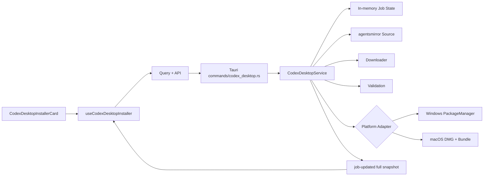

# FyAgent V1 — Agent 开发起点

> 文档状态：V1 开发基线已冻结
> 目标读者：负责实现、代码集成和验证的仓库维护者与贡献者
> 源码基线：CC Switch `3.18.0` 历史快照；实际开发前以当前仓库 checkout 的 commit SHA 为准并记录
> 产品名称：FyAgent

## 1. 先读什么

Agent 必须按以下顺序阅读，不允许只读取本文件后直接编码：

1. `01-V1-SCOPE-AND-NON-GOALS.md`
2. `02-REQUIREMENTS-AND-DECISIONS.md`
3. `03-AGENT-WORKTREE-EXECUTION.md`
4. `04-ARCHITECTURE.md`
5. `05-DOMAIN-MODEL-STATE-MACHINE-IPC.md`
6. 当前负责平台或前端对应的实现文档
7. `10-ERROR-CODES-AND-DIAGNOSTICS.md`
8. `11-REPOSITORY-CHANGE-MAP.md`
9. `12-IMPLEMENTATION-SEQUENCE.md`
10. `13-AUTOMATED-TEST-PLAN.md`

集成 Agent 还必须阅读 `14-MANUAL-ACCEPTANCE.md`、`16-ADR-DECISION-LOG.md` 和 `18-REFERENCES.md`。

## 2. 一句话产品定义

**FyAgent 的“一键安装 Codex”通过中国大陆友好的固定镜像，下载 OpenAI 官方原始、未经修改的最新版桌面应用包，并调用 Windows 或 macOS 原生机制完成安装；FyAgent 不创建、修改、重打包、重新签名或维护任何独立的 Codex/ChatGPT 分发版本。**

当前官方桌面产品的系统显示名称可能是 **ChatGPT**，其中包含 ChatGPT、Work 和 Codex。面向 FyAgent 用户的功能仍命名为“一键安装 Codex”。

## 3. 五条不可违反的约束

### 3.1 官方原包约束

不得执行以下行为：

- 修改 MSIX 的 `AppxManifest.xml`、Package Identity、Publisher、签名或包内容；
- 修改 macOS `.app` 内的 `Info.plist`、Bundle ID、可执行文件、图标、签名或任意资源；
- 对官方包重新压缩、重新打包、重新签名；
- 把官方安装包内置进 FyAgent 安装包；
- 对外使用“FyAgent 版 Codex”“国内定制版 ChatGPT”等表述。

### 3.2 中国大陆友好网络约束只作用于最终产品运行时

最终产品的安装器运行链路只依赖以下内置端点：

```text
https://codexapp.agentsmirror.com/latest/manifest
https://codexapp.agentsmirror.com/latest/checksums
https://codexapp.agentsmirror.com/latest/win-x64
https://codexapp.agentsmirror.com/latest/win-arm64
https://codexapp.agentsmirror.com/latest/mac-arm64
```

普通用户路径不得把 OpenAI 官网、GitHub Releases、Microsoft Store 网页、npm、crates.io 或其他境外站点作为完成安装所必需的运行时依赖。镜像不可用时，保留本地已安装应用的启动能力，并提供重试与使用 FyAgent 现有全局代理的提示；不得静默跳转到境外下载页。

**开发阶段不受该约束。** 开发贡献者可以正常使用 GitHub、官方文档、npm、crates.io 和其他开发资源，也可以安装缺失环境。不得把开发机国内镜像配置强制写入仓库。

### 3.3 V1 普通 UI 只执行当前用户安装

Windows 普通 UI：

- 不显示安装范围；
- 不触发 UAC；
- 固定调用当前用户安装；
- 不自动降级或升级为所有用户安装。

Windows 所有用户能力仅作为隐藏实验性 CLI/headless 路径保留，用于人工实验，不是普通用户功能，不阻断 V1 发布。

### 3.4 V1 不恢复 Codex CLI 安装能力

保留 Codex CLI 的只读信息：本地版本、线上版本、安装分布和环境诊断。禁止从 FyAgent 安装、升级或修复 Codex CLI；后端必须拒绝直接 IPC 调用，不能只隐藏前端按钮。

### 3.5 不做真实安装自动化 E2E

Agent 和 CI 不得：

- 下载完整生产安装包并执行真实安装；
- 覆盖 `/Applications`；
- 调用真实 PackageManager 安装 Codex；
- 卸载或清理用户已有应用；
- 强制结束 ChatGPT/Codex；
- 声称人工真机验收已通过。

平台真机验收由人工完成。

## 4. 开发前基线记录

在当前仓库 checkout 中执行：

```bash
git switch main
git status --short
git rev-parse HEAD
node --version
pnpm --version
rustc --version
cargo --version
```

必须确认：

```text
package.json version == 3.18.0
src-tauri/Cargo.toml version == 3.18.0
工作区无未提交修改
文档中列出的关键路径存在
```

然后创建集成分支：

```bash
git switch -c feature/fyagent-v1
```

基线 SHA、工具链版本和任何与上传快照不同的目录结构，写入最终 PR 描述或集成日志。

上传快照校验值：

```text
cc-switch-main.zip
SHA-256: 21e8822ebbee2b865854d04fc02c6b5ca0f057ddccd234a1479f71d2543163f4

vibekey_new-dev-yongjie.zip
SHA-256: bcb52936a50ad0dd7d32d71027547dd5ee68096752ba427212b95090a4fb8e13
```

VibeKey 只用于理解行为与测试场景，不复制其生产代码。

## 5. V1 支持矩阵

| 平台 | 实现级别 | 自动化验证 | 最终验收 |
|---|---|---|---|
| Windows x64 | 正式支持 | 编译、单元、fixture、mock | 人工真机阻断签收 |
| Windows ARM64 | 正式实现；包可用性按本架构 latest | 编译、单元、fixture、mock | 人工真机阻断签收 |
| macOS Apple Silicon | 正式支持 | 编译、单元、fixture、mock | 人工真机阻断签收 |
| macOS Intel | V1 不实现 | 架构分支测试 | UI 显示暂不支持 |
| Linux | 不提供桌面安装功能 | 后端必须可编译 | 安装卡片隐藏 |
| Windows 所有用户 | 隐藏实验能力 | 单元与 mock | 结果记录，不阻断 V1 |

## 6. 架构总览



依赖方向必须保持：

```text
commands → services → codex_desktop domain/platform
frontend component → hook → query/api → Tauri IPC
```

`commands` 不得承载业务流程；`App.tsx` 不得承载下载、事件或平台状态逻辑。

## 7. 并行开发入口

推荐四个 worktree：

```text
fyagent-core     领域模型、source、download、verify、job、IPC 契约
fyagent-windows  Windows 平台实现与测试
fyagent-macos    macOS 平台实现与测试
fyagent-ui       前端 API、Query、Hook、Card、中英文
```

共享注册文件只由集成 Agent 修改：

```text
src-tauri/src/lib.rs
src-tauri/src/store.rs
src-tauri/src/commands/mod.rs
src-tauri/src/services/mod.rs
src-tauri/Cargo.toml
src-tauri/tauri.conf.json
package.json
src/main.tsx
```

具体规则见 `03-AGENT-WORKTREE-EXECUTION.md`。

## 8. 最小完成定义

代码实现完成必须同时满足：

- 所有 P0 需求实现；
- 普通 Windows UI 固定当前用户安装；
- 镜像不可用时本地已安装应用仍可启动；
- 下载、哈希、包身份、平台架构和安装后状态均有严格校验；
- Windows/macOS 平台代码通过 `cfg` 隔离，Linux CI 可编译；
- Codex CLI 安装、升级、修复入口和后端执行能力已移除；
- FyAgent 上游自动更新已禁用；
- 当前产品、运行时、构建、安装、落盘与协议身份已切换为 FyAgent clean break，
  不迁移或兼容读取旧身份；真实仓库、历史/法律/上游与合作方契约值保留；
- 本地仅完成非编译静态审计；编译、测试与打包结果以 Draft PR CI 为准；
- 未进行或声称进行真实安装 E2E；
- 人工验收文档已准备，结果由人工填写。

## 9. 质量门槛命令

```bash
pnpm install --frozen-lockfile
pnpm typecheck
pnpm format:check
pnpm test:unit

cargo fmt --check --manifest-path src-tauri/Cargo.toml
cargo clippy --manifest-path src-tauri/Cargo.toml -- -D warnings
cargo test --manifest-path src-tauri/Cargo.toml
```

不得以“平台当前不可用”为由跳过 Windows、macOS 或 Linux CI。

## 10. 发生冲突时的裁决顺序

1. 本文档包中明确的 `P0` 约束；
2. `02-REQUIREMENTS-AND-DECISIONS.md` 中的最终决策；
3. 平台实现文档；
4. CC Switch 现有架构与代码惯例；
5. VibeKey 仅作参考，不具有实现优先级。

外部产品或镜像协议发生变化时，不得猜测。先停止实现、记录证据，并根据 `18-REFERENCES.md` 的权威来源重新核验。
