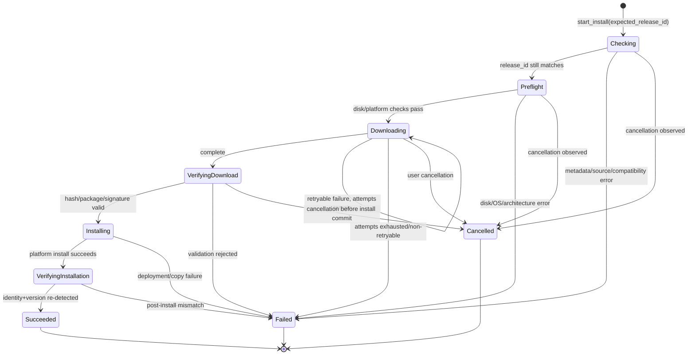

# 领域模型、状态机与 IPC 契约

## 1. 目的

本文件冻结 FyAgent V1 的后端领域模型、安装任务状态机、前后端 IPC 形态和并发不变量。开发 Agent 可以根据实际 Rust/TypeScript 代码风格调整字段命名，但不得改变本文定义的语义。

核心原则：

- Rust 后端是安装状态、版本比较、取消边界和错误分类的唯一权威；
- React 不重建安装状态机，只消费后端快照；
- 普通 UI 只支持当前用户安装，不暴露 `InstallScope`；
- Windows 所有用户预配是独立的隐藏实验 CLI/headless 能力，不进入普通 IPC；
- 全局最多一个桌面应用安装任务；
- 页面卸载、重新挂载或错过事件后，必须可通过快照查询恢复；
- V1 不将任务、远程版本或临时文件状态写入 SQLite/settings。

## 2. 值对象与枚举

### 2.1 平台与架构

```rust
#[derive(Debug, Clone, Copy, Serialize, Deserialize, PartialEq, Eq, Hash)]
#[serde(rename_all = "snake_case")]
pub enum DesktopPlatform {
    Windows,
    Macos,
}

#[derive(Debug, Clone, Copy, Serialize, Deserialize, PartialEq, Eq, Hash)]
#[serde(rename_all = "snake_case")]
pub enum CpuArchitecture {
    X86_64,
    Aarch64,
    X86_64UnsupportedMac,
    Unsupported,
}
```

实现可以把不支持架构放在独立检测结果中，而不是加入 `CpuArchitecture`；但 IPC 必须能够区分：

- Windows x64；
- Windows ARM64；
- macOS Apple Silicon；
- macOS Intel（明确暂不支持）；
- 其他平台/架构。

禁止 Windows ARM64 自动回退到 x64 包。

### 2.2 平台版本

不同平台不能使用同一个字符串比较算法：

```rust
#[derive(Debug, Clone, Serialize, Deserialize, PartialEq, Eq)]
#[serde(tag = "kind", rename_all = "snake_case")]
pub enum PlatformVersion {
    WindowsMsix {
        major: u16,
        minor: u16,
        build: u16,
        revision: u16,
    },
    MacBundle {
        bundle_version: String,
    },
}
```

规则：

- Windows 比较 `Package.Id.Version`/MSIX Identity 的四段无符号整数；
- macOS 比较 `CFBundleVersion`，解析器必须根据真实官方格式实现确定性比较；
- `CFBundleShortVersionString` 和镜像展示版本只用于 UI；
- 无法可靠比较时返回结构化错误，不允许按普通字典序猜测；
- 本地版本高于镜像版本时只允许启动，不自动降级。

### 2.3 本地安装状态

```rust
#[derive(Debug, Clone, Serialize, Deserialize)]
#[serde(tag = "state", rename_all = "snake_case")]
pub enum LocalInstallStatus {
    NotInstalled {
        platform: DesktopPlatform,
        architecture: CpuArchitecture,
    },
    Installed {
        application: InstalledApplication,
    },
    Unsupported {
        reason: UnsupportedReason,
    },
    Ambiguous {
        candidates: Vec<InstalledApplicationSummary>,
        error: InstallerErrorDto,
    },
}
```

`InstalledApplication` 至少包含：

```rust
pub struct InstalledApplication {
    pub stable_identity: String,
    pub display_name: Option<String>,
    pub display_version: Option<String>,
    pub platform_version: PlatformVersion,
    pub architecture: CpuArchitecture,
    pub location: Option<String>,
    pub launch_target: LaunchTarget,
}
```

约束：

- Windows `stable_identity` 是允许的 Stable Package Identity；
- macOS `stable_identity` 是允许的 Stable Bundle ID；
- `location` 发送给前端前不得泄露不必要的完整用户名路径；普通卡片通常不展示；
- `launch_target` 是后端内部可信对象，不允许前端提供任意 executable/path；
- 多个 macOS Stable 安装返回 `Ambiguous` 并阻断更新，不由前端选择任意一个。

### 2.4 远程 Release

```rust
pub struct ReleaseDescriptor {
    pub release_id: String,
    pub source: ReleaseSourceId,
    pub platform: DesktopPlatform,
    pub architecture: CpuArchitecture,
    pub display_version: String,
    pub platform_version: PlatformVersion,
    pub artifact_file_name: String,
    pub expected_sha256: String,
    pub expected_size: u64,
    pub download_endpoint: TrustedDownloadEndpoint,
    pub minimum_os_version: Option<String>,
}
```

`ReleaseDescriptor` 只能由 `AgentsMirrorSource` 在以下校验完成后生成：

1. checksums 解析成功；
2. manifest 原始字节通过清单校验；
3. 当前平台/架构分支完整；
4. artifact 文件名、hash、size、版本相互一致；
5. 下载端点来自代码内置枚举，而不是远程任意 URL；
6. 当前系统满足下载前可判断的最低要求。

前端只接收安全子集：

```rust
pub struct RemoteReleaseStatus {
    pub release_id: String,
    pub display_version: String,
    pub platform_version: PlatformVersion,
    pub expected_size: u64,
    pub checked_at: String,
}
```

不得把 S3/R2 最终预签名 URL 或 query 参数返回前端。

## 3. `release_id` 规范

`release_id` 用于阻止“用户看到版本 A，点击时实际安装版本 B”。它不是镜像 Release 标题，也不是可由远程直接指定的 ID。

建议 canonical payload：

```text
schema=fyagent-codex-release-v1\n
source=agentsmirror\n
platform=<windows|macos>\n
architecture=<x86_64|aarch64>\n
artifact_file_name=<exact filename>\n
platform_version=<canonical platform version>\n
expected_sha256=<lowercase 64 hex>\n
expected_size=<decimal bytes>\n
```

然后：

```text
release_id = "v1:" + lowercase_hex(SHA-256(UTF-8 canonical payload))
```

规范要求：

- 字段顺序固定；
- 换行和编码固定；
- 不包含临时 redirect URL、抓取时间或本地路径；
- Rust 单元测试使用固定向量锁定输出；
- 前端不自行计算，只透传后端返回的值；
- 开始安装前后端强制绕过缓存重新解析元数据；
- ID 变化返回 `METADATA_CHANGED`，不静默安装新版本。

## 4. 安装任务模型

### 4.1 JobStage

```rust
#[derive(Debug, Clone, Copy, Serialize, Deserialize, PartialEq, Eq)]
#[serde(rename_all = "snake_case")]
pub enum JobStage {
    Checking,
    Preflight,
    Downloading,
    VerifyingDownload,
    Installing,
    VerifyingInstallation,
    Succeeded,
    Failed,
    Cancelled,
}
```

`Idle`、`ReadyToInstall`、`ReadyToUpdate` 不是运行中 Job 的阶段，而是由本地状态 + 远程 release 在前端 View Model 中推导的页面状态。这样避免把“没有任务”伪装成长期 job。

### 4.2 JobSnapshot

```rust
pub struct JobSnapshot {
    pub job_id: String,
    pub sequence: u64,
    pub stage: JobStage,
    pub release: RemoteReleaseStatus,
    pub started_at: String,
    pub updated_at: String,
    pub progress: Option<JobProgress>,
    pub cancellable: bool,
    pub result: Option<InstallResult>,
    pub error: Option<InstallerErrorDto>,
}
```

`JobProgress` 建议：

```rust
pub struct JobProgress {
    pub phase: ProgressPhase,
    pub completed_bytes: Option<u64>,
    pub total_bytes: Option<u64>,
    pub percent: Option<f32>,
}
```

不要求 ETA 或速度预测。百分比必须 clamp 到 `[0, 100]`，未知总大小时不伪造百分比。

### 4.3 快照序列

- `sequence` 在同一个 `job_id` 内严格单调递增；
- 每次阶段、进度、错误或可取消性变化都发布完整新快照；
- 前端只接受新 `job_id`，或同 `job_id` 且 `sequence` 更大的快照；
- 后端不得复用旧 job ID；
- 推荐 UUID/随机 128-bit ID，不使用可预测自增 ID 作为安全凭据；
- Job ID 只用于关联，不授权文件访问或提权。

## 5. 状态机



### 5.1 阶段不变量

| 阶段 | 必须成立 |
|---|---|
| `Checking` | 还未信任前端提交的 release；正在强制重新解析远程元数据 |
| `Preflight` | 已锁定 descriptor；检查平台、运行状态、磁盘空间和临时目录 |
| `Downloading` | 只访问内置短链及其合规 HTTPS redirect；写入 job 专属临时文件 |
| `VerifyingDownload` | 下载句柄关闭；先 hash，再做包解析/签名/身份校验 |
| `Installing` | 已获得 `VerifiedPackage`；原始未验证路径不能直接进入平台 installer |
| `VerifyingInstallation` | 平台操作已返回；必须重新查询系统实际安装状态 |
| `Succeeded` | Stable 身份和版本满足 descriptor；临时安装包已安排清理 |
| `Failed` | 有且仅有一个稳定错误；不得把失败标记成成功 Toast |
| `Cancelled` | 已停止可取消工作，未开始不可逆平台安装；部分文件已清理 |

### 5.2 取消边界

| 阶段 | 是否允许取消 | 行为 |
|---|---|---|
| `Checking` | 是 | 取消元数据请求，清理临时状态 |
| `Preflight` | 是 | 在进入安装前终止 |
| `Downloading` | 是 | 取消流、关闭文件、删除部分包 |
| `VerifyingDownload` | 是 | 检查 cancellation token；安全停止校验 |
| `Installing` | 否 | UI 禁用取消；不强杀系统部署/复制进程 |
| `VerifyingInstallation` | 否 | 必须确认最终状态 |
| 终态 | 否 | 取消命令返回当前快照或明确 no-op 语义 |

竞态要求：`cancel` 与“进入 Installing”竞争时，后端必须在同一锁/原子状态转换中裁决。不能出现 UI 收到 Cancelled，但平台安装仍被启动。

## 6. 单任务并发模型

`CodexDesktopService` 建议持有：

```rust
pub struct CodexDesktopService {
    source: Arc<dyn ReleaseSource>,
    platform: Arc<dyn CodexDesktopPlatform>,
    job: Arc<Mutex<Option<JobController>>>,
    release_cache: Arc<RwLock<ReleaseCache>>,
    // command runner / clock / temp root / event emitter 等窄依赖
}
```

不变量：

- `start_install` 必须原子检查并占用唯一 job 槽；
- 已有非终态 job 时返回 `JOB_ALREADY_RUNNING`；
- 已有终态 job 可以创建新 job，但旧事件不得覆盖新 job；
- 长时间网络/IO 不持有全局 mutex；只在读取/更新 controller 快照时加锁；
- cancellation token 与 snapshot 更新由同一 controller 管理；
- panic/JoinError 映射为 `INTERNAL_ERROR` 并尽可能发布 Failed；
- 页面离开不会取消任务；
- 应用重启不恢复任务，启动时清理超过 24 小时的旧临时目录。

## 7. 安装请求

普通 IPC：

```rust
pub struct StartInstallRequest {
    pub expected_release_id: String,
}
```

不得包含：

```text
InstallScope
URL
文件路径
SHA-256
Package Identity
Bundle ID
目标安装目录
是否跳过签名校验
是否允许降级
```

这些值均由后端可信配置、平台规则和重新解析的 descriptor 决定。

普通 `start_install` 永远调用 `install_current_user`。Windows all-users 实验入口由命令行参数进入，不能复用此公开 Tauri command 传入 scope。

## 8. Tauri IPC 契约

命令名固定采用 snake_case：

```rust
#[tauri::command]
async fn codex_desktop_get_local_status(
    state: State<'_, AppState>,
) -> Result<LocalInstallStatus, InstallerErrorDto>;

#[tauri::command]
async fn codex_desktop_check_latest(
    force: Option<bool>,
    state: State<'_, AppState>,
) -> Result<RemoteReleaseStatus, InstallerErrorDto>;

#[tauri::command]
async fn codex_desktop_get_job(
    state: State<'_, AppState>,
) -> Result<Option<JobSnapshot>, InstallerErrorDto>;

#[tauri::command]
async fn codex_desktop_start_install(
    request: StartInstallRequest,
    state: State<'_, AppState>,
) -> Result<JobSnapshot, InstallerErrorDto>;

#[tauri::command]
async fn codex_desktop_cancel_install(
    job_id: String,
    state: State<'_, AppState>,
) -> Result<JobSnapshot, InstallerErrorDto>;

#[tauri::command]
async fn codex_desktop_launch(
    state: State<'_, AppState>,
) -> Result<(), InstallerErrorDto>;

#[tauri::command]
async fn codex_desktop_open_log_directory(
    state: State<'_, AppState>,
) -> Result<(), InstallerErrorDto>;
```

实际源码若统一使用 `Result<T, String>`，本功能仍应先构造结构化 `InstallerErrorDto`，再按项目 IPC 错误惯例序列化；前端必须能够稳定取得 `code`，不能只收到不可解析的人类字符串。

### 8.1 命令语义

#### `get_local_status`

- 只访问本机，不联网；
- 镜像不可用时仍可调用；
- 不读取任意用户提供路径；
- 安装任务进行中也可返回最后一次独立检测结果，但 UI 以 active job 为主。

#### `check_latest(force)`

- `force=false/None` 可使用五分钟内存缓存；
- `force=true` 绕过缓存；
- 不启动下载；
- 不改变本地状态；
- 远程失败不能把本地已安装应用标记为未安装。

#### `get_job`

- 返回当前/最后一个内存 job 快照；
- 应用刚启动且无 job 返回 `None`；
- 不从磁盘恢复旧任务。

#### `start_install`

1. 校验 ID 格式和长度；
2. 原子占用任务槽；
3. 立即返回首个 `Checking` 快照；
4. 后台异步执行流程；
5. 强制重新解析 release；
6. 不接受或推断所有用户 scope；
7. 不允许空 ID、未知 ID、过期 ID、降级或重装绕过。

#### `cancel_install(job_id)`

- job ID 不匹配返回 `JOB_NOT_FOUND` 或稳定等价错误；
- 不允许取消 `Installing`/`VerifyingInstallation`；
- 对已经终止的同一 job 返回其当前快照，保持幂等；
- 不强制杀死官方应用或系统 installer。

#### `launch`

- 每次重新检测 Stable 安装；
- Windows 使用已验证 AUMID；
- macOS 使用已验证的实际 Bundle 路径；
- 不接受前端传入路径/应用名；
- 远程检查失败不影响此命令。

#### `open_log_directory`

- 只打开 FyAgent 已有日志目录；
- 不接受任意 path；
- 不生成或上传诊断 ZIP。

## 9. 事件契约

事件名：

```text
codex-desktop-installer://job-updated
```

载荷：完整 `JobSnapshot`。

后端发布时机：

- 创建 Job；
- 进入每个新阶段；
- 下载进度发生有意义变化；
- retry attempt 变化；
- cancellable 变化；
- 进入终态。

进度节流建议：

- 时间间隔不短于约 100–250 ms，或百分比/字节跨过阈值；
- 最终 100% 和阶段转换不得被节流丢失；
- 不为每个网络 chunk 发 Tauri event。

前端挂载顺序：

```text
1. 建立事件 listener
2. 调用 codex_desktop_get_job
3. 以 job_id + sequence 合并快照
```

也可以先查询再订阅，但必须再查询一次或使用序号消除查询/订阅间隙；文档推荐“先订阅、再查询”。

## 10. TypeScript 对应类型

Rust DTO 与 TypeScript 必须一一对应，建议：

```ts
export type JobStage =
  | "checking"
  | "preflight"
  | "downloading"
  | "verifying_download"
  | "installing"
  | "verifying_installation"
  | "succeeded"
  | "failed"
  | "cancelled";

export interface JobSnapshot {
  jobId: string;
  sequence: number;
  stage: JobStage;
  release: RemoteReleaseStatus;
  startedAt: string;
  updatedAt: string;
  progress?: JobProgress | null;
  cancellable: boolean;
  result?: InstallResult | null;
  error?: InstallerError | null;
}
```

是否使用 camelCase 由现有 Tauri serde 约定决定；Rust 必须显式 `serde(rename_all = "camelCase")` 或前端按实际 snake_case 定义，禁止两端各自猜测。

推荐增加 fixture/contract 测试：

- Rust 序列化一个完整快照到 JSON fixture；
- TypeScript 测试读取该 fixture；
- 或使用项目已有类型生成机制（若存在）；
- 至少测试 tagged enum 的所有分支。

## 11. 平台 Adapter 契约

通用 service 只依赖：

```rust
#[async_trait]
pub trait CodexDesktopPlatform: Send + Sync {
    fn platform(&self) -> DesktopPlatform;
    fn architecture(&self) -> CpuArchitecture;

    async fn inspect_local(
        &self,
    ) -> Result<LocalInstallStatus, InstallerError>;

    async fn preflight(
        &self,
        release: &ReleaseDescriptor,
        temp_root: &Path,
    ) -> Result<PlatformInstallPlan, InstallerError>;

    async fn verify_package(
        &self,
        release: &ReleaseDescriptor,
        package_path: &Path,
    ) -> Result<VerifiedPackage, InstallerError>;

    async fn install_current_user(
        &self,
        package: &VerifiedPackage,
        progress: PlatformProgressSink,
    ) -> Result<(), InstallerError>;

    async fn launch(
        &self,
        installed: &InstalledApplication,
    ) -> Result<(), InstallerError>;
}
```

安全边界：

- `VerifiedPackage` 的字段私有或构造器受限，只有校验模块能创建；
- 平台 installer 不接受裸下载路径；
- Windows all-users 不加入此 trait；
- Linux/unsupported adapter 返回 `PLATFORM_UNSUPPORTED`，但 crate 可编译；
- command runner、WinRT deployment facade、clock 和 filesystem 可注入 fake。

## 12. 安装结果验证

平台安装函数返回“系统调用完成”不等于成功。Service 必须再次 `inspect_local` 并确认：

```text
stable identity == expected stable identity
architecture compatible
installed platform_version >= target platform_version
且不存在多安装歧义
```

V1 预期通常精确等于 target；使用 `>=` 是为了容忍官方应用在极短时间内自行更新。若本地仍旧、身份错误或检测不到，返回 `INSTALLATION_VERIFY_FAILED`。

不得根据以下信号单独宣告成功：

- MSIX/DMG 文件存在；
- 系统命令退出码为 0；
- `/Applications/ChatGPT.app` 路径存在；
- `ChatGPT.exe` 进程存在；
- UI progress 达到 100%；
- Toast 已显示。

## 13. 退出行为

窗口/应用请求退出时：

- 无 active job：正常退出；
- `Checking/Preflight/Downloading/VerifyingDownload`：提示退出会取消任务；用户确认后触发 cancellation，再退出；
- `Installing/VerifyingInstallation`：提示正在安装，应等待完成；普通路径不提供强制终止；
- 不能因关闭某个 React 页面而触发退出逻辑；
- 平台部署异常中断后的下一次启动只做临时目录清理和本地状态重检，不声称恢复旧 job。

具体窗口钩子应复用 CC Switch 现有退出/托盘行为，避免创建第二套互相冲突的 close handler。

## 14. 测试要求

至少覆盖：

1. 平台版本比较：小于、等于、大于、非法格式；
2. canonical `release_id` 固定向量；
3. 每个合法状态转换；
4. 非法状态转换被拒绝；
5. cancel 与 Installing 边界竞态；
6. 单任务互斥；
7. sequence 单调和旧事件丢弃；
8. start 时 metadata 已变化；
9. remote 失败不影响 local launch；
10. 安装系统调用成功但后验检测失败；
11. TypeScript/Rust DTO JSON 兼容；
12. 普通 `StartInstallRequest` 无 scope/URL/path 字段；
13. Linux 构建下 unsupported adapter 可编译；
14. all-users 实验代码无法通过普通 Tauri IPC 触达。

## 15. 完成定义

本领域与 IPC 层只有在以下条件同时满足时完成：

- DTO 和 tagged enum 已冻结并有序列化测试；
- `release_id` 规范有固定测试向量；
- Job 状态机集中实现，不散落在 commands/React；
- 单任务和取消竞态有测试；
- 七个普通 IPC 命令语义完整；
- event 是完整快照并带序号；
- 普通安装请求没有 scope、自定义 URL、路径或校验绕过；
- Windows all-users 只能从隐藏 headless/CLI 入口到达；
- 安装后重新检测是 Succeeded 的必要条件；
- 前端可以在页面重新挂载后恢复 active job；
- 无数据库/schema/settings 变更。
